# **Robosense 软件包使用指南**
***V 1.2.0 beta***
- [1. 简介](#1-简介)
    - [1.1.  目录结构](#11-目录结构)
- [2. 硬件需求和软件依赖](#2-硬件需求和软件依赖)
    - [2.1. 硬件需求](#21-硬件需求)
    - [2.2. 软件依赖](#22-软件依赖)
- [3. 安装和编译](#3-安装和编译)
- [4. 标定](#4-标定)
    - [4.1 雷达标定](#41-雷达标定)
    - [4.2 其他传感器标定](#42-其他传感器标定)
- [5. 参数介绍](#5-参数介绍)
	- [5.1 参数结构](#51-参数结构)
	- [5.2 雷达参数](#52-雷达参数)
	- [5.3 其他传感器参数](#53-其他传感器参数)
- [6. 快速启动](#6-快速启动)
    - [6.1 快速启动感知算法](#61-快速启动感知算法)
        - [6.1.1  配置参数文件名](#611-配置参数文件名)
        - [6.1.2 配置参数](#612-配置参数)
        - [6.1.3  启动](#613-启动)
        - [6.1.4 结果](#614-结果)
    - [6.2  快速启动定位算法](#62-快速启动定位算法)
        - [6.2.1  配置参数文件名](#621-配置参数文件名)
        - [6.2.2  添加地图文件](#622-添加地图文件)
        - [6.2.3  配置参数](#623-配置参数)
        - [6.2.4  启动](#624-启动)
        - [6.2.5 结果](#625-结果)
    - [6.3  快速启动感知算法&定位算法](#63-快速启动感知算法定位算法)
        - [6.3.1  配置参数文件名](#631-配置参数文件名)
        - [6.3.2  添加地图文件](#632-添加地图文件)
        - [6.3.3  配置参数](#633-配置参数)
        - [6.3.4  启动](#634-启动)
        - [6.3.5 结果](#635-结果)
- [7. 使用进阶](#7-使用进阶)
    - [7.1. 获取地图任意位置坐标](#71-获取地图任意位置坐标)
    - [7.2. 二次开发](#72-二次开发)
- [8. 常见错误](#8-常见错误)
- [9. 联系方式](#9-联系方式)

- - -
## 1. 简介
rs_sdk 为速腾聚创激光雷达算法的统一运行空间。

本SDK包含：

- 激光雷达障碍物感知算法: **rs_perception**

- 激光雷达定位算法: **rs_localization**

- 雷达驱动模块: **rs_lidar**

- 原始数据整合模块： **rs_sensor**

- 数据预处理模块: **rs_preprocessing**

- 基本模块: **rs_common**


- - -
**用户可根据授权许可， 使用相应的算法模块**
- - -
### 1.1.  目录结构

- - -

- - -


## 2. 硬件需求和软件依赖
### 2.1. 硬件需求

- X86 平台 (笔记本、台式电脑或者工控机，需要配备计算能力匹配的显卡（>= Nvidia GTX1060）)

- 移动ARM平台( Nvidia Jetson Tx2或者更高性能设备（例如Nvidia Jetson AGX Xavier）)


**注意：**

- Robosense Perception SDK 是在 **Linux Ubuntu 16.04 64位 操作系统**下在**ROS kinetic**的辅助下开发的，所以推荐使用相同的配置， **windows系统目前还不支持**；
- 因为通信模块依赖底层网卡硬件, **虚拟机目前还不支持**；
- **SDK不依赖于ROS** ，但使用ROS可以方便的录包&播包，并且可以使用rviz直观的看到运行结果，**强烈建议安装ROS-Kinetic-FULL**

### 2.2. 软件依赖
**在开始部署SDK之前，请确保如下库已经正确安装并配置好**
- cmake (最低版本3.5)
- PCL 1.7.1 或者更高版本
- Boost 1.54 或者更高版本
- Eigen 3.x 或者更高版本
- Protobuf 2或3
- yaml 0.5.x
- OpenCV 2.x 或者 3.x
- CUDA 10.0 软件集合
  - 显卡驱动（>=410.48）
  - CUDA 10.0
  - CUDA 10.0 配套的cudnn
  - CUDA 10.0 配套的TensorRT

**请不要同时安装两个不同版本的protobuf**
- - -
**具体安装方法可参考依赖包文件夹内的安装指导**
- - -
 


## 3. 安装和编译
初次安装，请先运行以下指令解压压缩包
```
$sudo tar -xf rs_sdk_xxxx.tar.gz
```
解压完成后， 进入工作空间，为install_dependency.sh 添加可执行权限并执行
```
$sudo chmod a+x install_dependency.sh
$sudo ./install_dependency.sh
```
完成后打开主目录下的CMakeLists.txt文件
```
gedit CMakeLists.txt
```
购买了定位算法和感知算法的用户，请确保CMakeLists第3行和第4行，均设为TRUE， 如下图所示
- - -
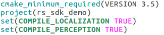
- - -
只购买了感知算法的用户，请确保CmkaeLists第3行为FALSE， 第4行为TRUE， 如下图所示
- - -
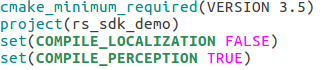
- - -
只购买了定位算法的用户，请确保CmkaeLists第3行为TRUE， 第4行为FALSE， 如下图所示
- - -

- - -
**除此之外，请不要修改CMakeLists.txt中的任何代码！**
- - -
关闭CMakeLists.txt文件并在工作空间主目录下创建build文件夹,进入build文件夹
```
mkdir build
cd build/
```
编译程序
```
cmake ../
make -j
```
**若编译失败，请检查依赖项是否安装齐全， 若问题无法解决， 请联系技术支持**

- - -
**注意！ 倘若编译完成后改变了工作空间的路径，需重新编译！**
- - -

## 4. 标定
在编译成功后，需要先进行标定参数的配置。首先需要了解一下坐标系的定义。

- - -
X指向车辆正前方，Y指向车辆左侧，Z指向天空，原点是在车辆后轮中心在地面的正投影的包围盒的几何中心，即原点是在地面上，如下图:

- - -

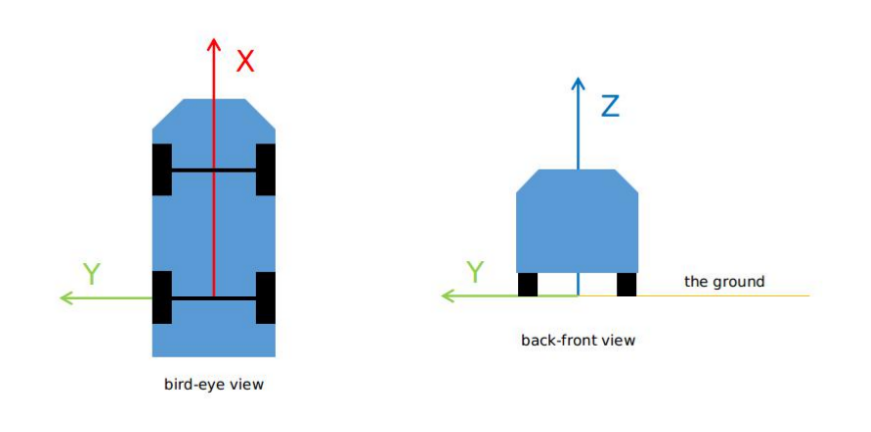

- - -

进入usr_config文件夹，打开calibration.yaml文件
```
cd config/usr_config/
gedit calibration.yaml
```

**注意: 标定的准确程度将直接影响感知与定位算法的结果准确度！**

### 4.1 雷达标定
**用户可选择购买我司标定软件自行标定，也可联系我司技术支持为您标定**

- - -

在标定完成后， 将正确的标定参数填入calibration.yaml中.一个雷达的情况如下示例（具体标定参数需根据实际情况填写）：
```yaml
lidar:  
  - parent_frame_id: /base_link  
    frame_id: /middle_lidar 
    x: 0
    y: 0 
    z: 0 
    roll: 0
    pitch: 0 
    yaw: 0
```
rs_sdk目前支持至多6个雷达同时使用. 因此标定参数的配置请参考实际使用的雷达数目. 多雷达标定的原理为, 首先选出一个基准雷达, 将其他所有雷达标定至基准雷达, 然后将基准雷达标定至车体坐标系. 

以下为三雷达的例子, 假设三个雷达的frame_id分别为/middle_lidar, /left_lidar, /right_lidar, 我们选择/middle_lidar作为基准雷达, 车体坐标系frame_id为/base_link, 因此标定参数应如下所示填写(具体标定参数需根据实际情况填写):

```yaml
lidar:  
  - parent_frame_id: /base_link  					//表示中间雷达(基准雷达)标定至车体坐标系
    frame_id: /middle_lidar 
    x: 0
    y: 0 
    z: 0 
    roll: 0 
    pitch: 0 
    yaw: 0 

  - parent_frame_id: /middle_lidar					//表示左雷达标定至中间雷达
    frame_id: /left_lidar 
    x: 0
    y: 0
    z: 0
    roll: 0
    pitch: 0
    yaw: 0

  - parent_frame_id: /middle_lidar					//表示右雷达标定至中间雷达
    frame_id: /right_lidar 
    x: 0
    y: 0
    z: 0
    roll: 0
    pitch: 0
    yaw: 0
```

以下为五雷达的例子, 假设五个雷达的frame_id分别为/middle_lidar, /left_lidar, /right_lidar,/front_lidar,/back_lidar,  我们选择/middle_lidar作为基准雷达, 车体坐标系frame_id为/base_link, 因此标定参数应如下所示填写(具体标定参数需根据实际情况填写):

```yaml
lidar:  
  - parent_frame_id: /base_link  					//表示中间雷达(基准雷达)标定至车体坐标系
    frame_id: /middle_lidar 
    x: 0
    y: 0 
    z: 0 
    roll: 0 
    pitch: 0 
    yaw: 0 

  - parent_frame_id: /middle_lidar					//表示左雷达标定至中间雷达
    frame_id: /left_lidar 
    x: 0
    y: 0
    z: 0
    roll: 0
    pitch: 0
    yaw: 0

  - parent_frame_id: /middle_lidar					//表示右雷达标定至中间雷达
    frame_id: /right_lidar 
    x: 0
    y: 0
    z: 0
    roll: 0
    pitch: 0
    yaw: 0
  - parent_frame_id: /middle_lidar					//表示前雷达标定至中间雷达
    frame_id: /front_lidar 
    x: 0
    y: 0
    z: 0
    roll: 0
    pitch: 0
    yaw: 0

  - parent_frame_id: /middle_lidar					//表示后雷达标定至中间雷达
    frame_id: /back_lidar 
    x: 0
    y: 0
    z: 0
    roll: 0
    pitch: 0
    yaw: 0
```
**请注意! 必须有一个基准雷达, 且只能有一个基准雷达!**
**请注意! 标定参数中雷达数目,必须与您实际使用的雷达数目一致! 假设标定参数中写了3个雷达, 那么预处理模块会尝试去接收3个雷达的原始数据进行标定融合, 但若您实际使用的雷达数目少于3个, 则预处理模块会提示雷达超时的错误! 若实际使用的雷达数目多于3个, 则预处理模块会提示未定义的frame_id错误!**
### 4.2 其他传感器标定
若使用定位算法，除雷达外其他传感器也需标定（具体标定参数需根据实际情况填写）
```yaml
vehicle: 
  frame_id: /base_link  //车体坐标系frame_id, 建议不要修改。 所有传感器(包括雷达)，都会变换到车体坐标系下。
  
imu: 
  parent_frame_id: /base_link 
  frame_id: /imu 
  x: 0 
  y: 0 
  z: 0 
  roll: 0 
  pitch: 0 
  yaw: 0 
 
gnss: 
  parent_frame_id: /base_link 
  frame_id: /gnss 
  x: 0 
  y: 0 
  z: 0 
  roll: 0 
  pitch: 0 
  yaw: 0 
 
odom: 
  parent_frame_id: /base_link 
  frame_id: /odom 
  x: 0 
  y: 0 
  z: 0 
  roll: 0 
  pitch: 0 
  yaw: 0 
```
## 5.  参数介绍
***本章节很重要,请用户仔细阅读***

### 5.1 参数结构


rs_sdk的参数主要分为2个部分 **system_config**和**usr_config**

- system_config: 存放rs_sdk所需的所有参数文件
- usr_config: 因为system_config中的参数文件较多, 配置较复杂, 而其中大多数参数只需配置一次即可,并不需要经常修改(比如雷达的端口号,雷达数量, 使用的传感器型号等等参数, 一开始配置完成后基本不需要再改动). 为了降低用户使用rs_sdk的难度, 我们把system_config中较为常用的,且经常会改动的参数提取了出来,放在了usr_config中, 这样用户平时在使用时只需要修改usr_config中的参数就足够了, 操作难度大大降低. 

**注意! usr_config中的参数内容会覆盖掉system_config中的同名参数! 因此usr_config中有的参数请在usr_config中修改, 不要去system_config中修改! ** 


目前usr_config文件夹内一共有4份参数(1标定+3usr_config).


*calibration.yaml*: 标定参数文件, 无论用户购买了什么算法,此参数文件必备
*usr_config_only_localization.yaml*: 定位参数文件. 若用户只购买了定位算法, 请把此文件名配置在usr_config_name.yaml中,表示您将使用usr_config_only_localization.yaml作为您的参数文件.
*usr_config_only_perception.yaml*: 感知参数文件. 若用户只购买了感知算法, 请把此文件名配置在usr_config_name.yaml中,表示您将使用usr_config_only_perception.yaml作为您的参数文件.
*usr_config_perception_and_localization.yaml*: 定位&感知参数文件. 若用户同时购买了定位算法和感知算法, 请把此文件名配置在usr_config_name.yaml中,表示您将使用usr_config_perception_and_localization.yaml作为您的参数文件.


### 5.2 雷达参数
如5.1章节中提到的, 我们已经将用户常用的参数全部提取到了usr_config中, 而未提取的参数基本是只需要配置一次就无需再修改的. 雷达参数便是其中之一. 本节将指导用户如何配置雷达参数.

- - -
(1) 首先进入目录 /rs_sdk/config/system_config/sensor_config/lidar


可以看到此目录下默认有三个文件夹, 分别为left_lidar, middle_lidar, right_lidar. 这表示里面存放的分别是左雷达,中间雷达, 右雷达的参数.**不用去管rs_lidar.yaml中的参数, 里面的参数已经全部提取到了usr_config中, 所以在usr_config内可以配置.**

(2)进入 middle_lidar文件夹


lidar.yaml便是中间雷达的参数文件. 若您的雷达需要其他内参文件(.csv文件,可以联系技术支持获取), 请将内参文件放在此目录下. 

(3)打开lidar.yaml文件, 配置参数

```yaml

device_type: RS32             //雷达型号, 目前支持的型号有RS32(32线),RS16(16线),RSBP, 请填写正确的型号
frame_id: /middle_lidar      //雷达的frame_id,建议不要修改. 若修改了, 需要把文件夹名改成对应的frame_id, 并且在标定文件中也需要做对应的修改
device_ip: 192.168.1.201      //雷达ip地址, 可使用wireshark抓包软件查看
msop_port: 2000               //雷达msop packet 端口号, 可使用wireshark抓包软件查看
difop_port: 2001              //雷达difop packet端口号,可使用wireshark抓包软件查看
resolution_type: 0            //雷达分辨率. 自适应, 无需修改
intensity_mode: 3            //反射率模式, 自适应, 无需修改
echo_mode: 1                  //回波模式,自适应,无需修改
start_angle: 0                //雷达数据起始角度
end_angle: 360                //雷达数据结束角度
min_distance: 0.2             //雷达数据最小距离
max_distance: 200             //雷达数据最大距离
cut_angle: 180               //分包角度, 0~360
pcap: /robosense/work_space/bag/lidar.pcap    //若read_pcap设置为true, 需要设置正确的路径读取pcap包
read_pcap: false             //若为true, 离线解析pcap包中的雷达数据
use_lidar_clock: false       //若为true, 使用雷达内的时间戳. 若为false, 使用工控机的系统时间戳
timeout: 100                 //超时阈值, 无需修改
```

(4) 返回上一级目录


对于单雷达的用户,至此雷达参数已配置完毕. left_lidar和right_lidar文件夹是否删除并不会有影响. **决定实际使用的雷达数目的是usr_config中雷达的个数. **对于三雷达的用户,还需配置left_lidar和right_lidar中的雷达参数. 


### 5.3 其他传感器参数


**如果您只购买了感知算法, 可略过此章节**

**如果您购买了定位算法, 但不需要使用我司的传感器, 也可略过此章节**

目前rs_sdk中传感器驱动方面除了雷达,还继承了IMU, RTK, 以及车速的驱动.

- - -
**IMU** 

若您购买了我司的IMU, 请参考如下步骤配置IMU参数.
(1)进入目录/rs_sdk/config/system_config/sensor_config/other_sensors/imu


(2)打开imu_TL740D.yaml
```yaml
device_type: TL740D         // IMU型号,请勿修改!
auto_scan_port: false        // 是否自动扫描串口. 建议设为false, 多传感器时容易冲突导致连接失败
port_name: /dev/ttyUSB1     //imu串口号, 请填写正确的串口号
baudrate: 115200            //波特率
frame_id: /imu              //frame_id, 建议不要修改
do_reconnect: true          //中断后是否尝试重连, 无修修改
reconnect_interval: 1       //重连间隔(秒),无需修改
reconnect_attempts: 3       //重连次数,无需修改 
warning_gyro_z: 3.14        //角速度阈值, 若Z轴角速度大于此速度(rads/s),程序发出警告
timeout: 0.1               //超时阈值,无需修改

```
至此, IMU设置完毕
- - -
**RTK**


若您购买了我司的RTK, 请参考如下步骤配置RTK参数.
(1)进入目录/rs_sdk/config/system_config/sensor_config/other_sensors/ins


(2)打开ins_XWG13668.yaml
```yaml
device_type: XWG13668          // rtk型号,请勿修改!
auto_scan_port: true          // 是否自动扫描串口. 建议设为false, 多传感器时容易冲突导致连接失败
port_name: /dev/ttyUSB0       //rtk串口号, 请填写正确的串口号
baudrate: 115200              //波特率
frame_id: /ins                //frame_id, 建议不要修改
do_reconnect: true            //中断后是否尝试重连, 无修修改
reconnect_interval: 1         //重连间隔(秒),无需修改
reconnect_attempts: 3          //重连次数,无需修改
min_satellite: 3              //卫星数阈值, 若卫星数少于这个数目,程序会发出警告
warning_gyro_z: 3.14          //角速度阈值, 若Z轴角速度大于此速度(rads/s),程序发出警告
timeout: 0.1                  //超时阈值,无需修改
use_gnss_clock: false		//若为true, 使用rtk内的时间作为时间戳, 否则使用工控机的系统时间戳

```
至此,RTK设置完毕
- - -

**车速**


由于每个客户的车型,品牌均不一样, 我司并不提供车速驱动. 建议客户自行准备车速驱动, 之后将车速通过ROS或Protobuf发出即可.
- - -

## 6.  快速启动
**注意： 速腾聚创的算法采用USB KEY授权模式，必须将获得了相应算法的授权USB KEY 插在主机上才能使用相应的算法！ 若缺少相应的key, 请联系我司技术支持(联系方式在文末)**
- 只购买了感知模块的用户，请参考*5.1*——快速启动感知算法
- 只购买了定位模块的用户，请参考*5.2*——快速启动定位算法
- 购买了感知和定位模块的用户，请参考*5.3*——快速启动感知&定位算法
- - -
### 6.1 快速启动感知算法
####  6.1.1  配置参数文件名
进入工作空间目录下的config文件夹
```
cd rs_sdk/config
```
打开配置文件usr_config_name.yaml
```
gedit usr_config_name.yaml
```
将参数usr_config_name设置为 usr_config_only_perception.yaml


- - -


- - -


#### 6.1.2 配置参数
进入config文件夹里的usr_config文件夹
```
cd config/usr_config/
```
打开参数文件usr_config_only_perception.yaml
```
gedit usr_config_only_perception.yaml
```

- - -
**注意！ YAML文件对缩进的要求十分严格！在配置参数时请勿改变参数的缩进！**

**以下为快速启动感知算法的默认参数配置（单雷达）**

``` yaml
general:                   
    run_perception: true	//若启动感知算法，设为true
  
perception:
    common:
    	with_debug_info: false	//若希望运行时感知的debug信息输出到终端显示,设为true (建议设为false，否则其他的错误信息会被刷掉)
    
sensor:
    lidar:
        common:
            msg_source: 2    //雷达消息来源, 1: 雷达驱动 2：rosbag-packets 3:rosbag-点云 4,protobuf-packet 5,protobuf-点云
            send_packets_ros: false	//若希望将雷达原始packets发布到ros上，设为true
            send_points_ros: false	//若希望将雷达原始点云发布到ros上，设为true
        	send_packets_proto: false //若希望将雷达原始packets通过protobuf发出,设为true
            send_points_proto: false //若希望将雷达原始点云通过protobuf发出,设为true
        lidar:
            - driver:
                  include: ../system_config/sensor_config/lidar/middle_lidar/lidar.yaml //根据具体雷达型号，选择相应的雷达yaml配置文件
              ros:
                  ros_recv_points_topic: /rslidar_points		//若雷达消息来源为3，配置正确的接收topic名
                  ros_recv_packets_topic: /rslidar_packets	//若雷达消息来源为2，配置正确的接收topic名
                  ros_send_points_topic: /rslidar_points	//发布原始点云的topic名
                  ros_send_packets_topic: /rslidar_packets	//发布原始雷达packets的topic名
              proto:
				  points_send_port: 60021		//点云发送端口号
				  points_recv_port: 60021		//点云接收端口号
				  points_send_ip: 127.0.0.1		//点云发送地址
                  msop_send_port: 60022			//msop packet 发送端口号	(关于msop packet定义请参考雷达用户手册)
                  msop_recv_port: 60022			//msop packet 接收端口号
                  difop_send_port: 60023		//difop packet 发送端口号     (关于difop packet定义请参考雷达用户手册)
                  difop_recv_port: 60023		//difop packet 接收端口号
                  packets_send_ip: 127.0.0.1	//packet统一发送地址

result_sender:
	ros:
    	perception:                                              
			send_obstacle_ros: true		//若希望将感知结果(障碍物)发送到ros，设为true    
            send_groundpoint_ros: true  //若希望将感知结果(地面点)发送到ros，设为true    
            send_freespace_ros: true	//若希望将感知结果(可通行区域)发送到ros，设为true    
    	pointcloud:                                               
            send_uncompensated_cloud_ros: false	//若希望将融合点云发布到ros， 设为true
            
	proto:
    	perception:
            send_obstacle_proto: false		//若希望通过protobuf发送感知结果，设为true          
            send_obstacle_proto_port: 60000		//目标的端口号
            send_obstacle_proto_ip: 127.0.0.1		//目标地址
        pointcloud:           
			send fusion pointcloud result through Proto (UDP)                                         
            send_uncompensated_cloud_proto: false   //若希望将融合点云通过protobuf发出， 设为true     
            uncompensated_cloud_proto_port: 60030   //融合点云发送端口号      
            cloud_proto_ip: 127.0.0.1   //融合点云发送地址
```

- - -
**若为三雷达，只需在参数中sensor中的lidar部分新增两组雷达参数即可,注意缩进!**
```yaml
sensor:
    lidar:
        common:
            msg_source: 2    //雷达消息来源, 1: 雷达驱动 2：rosbag-packets 3:rosbag-点云 4,protobuf-packet 5,protobuf-点云
            send_packets_ros: false	//若希望将雷达原始packets发布到ros上，设为true
            send_points_ros: false	//若希望将雷达原始点云发布到ros上，设为true
        	send_packets_proto: false //若希望将雷达原始packets通过protobuf发出,设为true
            send_points_proto: false //若希望将雷达原始点云通过protobuf发出,设为true
        lidar:
            - driver:
                  include: ../system_config/sensor_config/lidar/middle_lidar/lidar.yaml //根据具体雷达型号，选择相应的雷达yaml配置文件
              ros:
                  ros_recv_points_topic: /middle/rslidar_points		//若雷达消息来源为3，配置正确的接收topic名
                  ros_recv_packets_topic: /middle/rslidar_packets	//若雷达消息来源为2，配置正确的接收topic名
                  ros_send_points_topic: /middle/rslidar_points	//发布原始点云的topic名
                  ros_send_packets_topic: /middle/rslidar_packets	//发布原始雷达packets的topic名
              proto:
				  points_send_port: 60021		//点云发送端口号
				  points_recv_port: 60021		//点云接收端口号
				  points_send_ip: 127.0.0.1		//点云发送地址
                  msop_send_port: 60022			//msop packet 发送端口号	(关于msop packet定义请参考雷达用户手册)
                  msop_recv_port: 60022			//msop packet 接收端口号
                  difop_send_port: 60023		//difop packet 发送端口号     (关于difop packet定义请参考雷达用户手册)
                  difop_recv_port: 60023		//difop packet 接收端口号
                  packets_send_ip: 127.0.0.1	//packet统一发送地址
			- driver:
                  include: ../system_config/sensor_config/lidar/left_lidar/lidar.yaml //根据具体雷达型号，选择相应的雷达yaml配置文件
              ros:
                  ros_recv_points_topic: /left/rslidar_points		//若雷达消息来源为3，配置正确的接收topic名
                  ros_recv_packets_topic: /left/rslidar_packets	//若雷达消息来源为2，配置正确的接收topic名
                  ros_send_points_topic: /left/rslidar_points	//发布原始点云的topic名
                  ros_send_packets_topic: /left/rslidar_packets	//发布原始雷达packets的topic名
              proto:
				  points_send_port: 60024		//点云发送端口号
				  points_recv_port: 60025		//点云接收端口号
				  points_send_ip: 127.0.0.1		//点云发送地址
                  msop_send_port: 60025			//msop packet 发送端口号	(关于msop packet定义请参考雷达用户手册)
                  msop_recv_port: 60025			//msop packet 接收端口号
                  difop_send_port: 60026		//difop packet 发送端口号     (关于difop packet定义请参考雷达用户手册)
                  difop_recv_port: 60026		//difop packet 接收端口号
                  packets_send_ip: 127.0.0.1	//packet统一发送地址
			- driver:
                  include: ../system_config/sensor_config/lidar/right_lidar/lidar.yaml //根据具体雷达型号，选择相应的雷达yaml配置文件
              ros:
                  ros_recv_points_topic: /right/rslidar_points		//若雷达消息来源为3，配置正确的接收topic名
                  ros_recv_packets_topic: /right/rslidar_packets	//若雷达消息来源为2，配置正确的接收topic名
                  ros_send_points_topic: /right/rslidar_points	//发布原始点云的topic名
                  ros_send_packets_topic: /right/rslidar_packets	//发布原始雷达packets的topic名
              proto:
				  points_send_port: 60027		//点云发送端口号
				  points_recv_port: 60027		//点云接收端口号
				  points_send_ip: 127.0.0.1		//点云发送地址
                  msop_send_port: 60028			//msop packet 发送端口号	(关于msop packet定义请参考雷达用户手册)
                  msop_recv_port: 60028			//msop packet 接收端口号
                  difop_send_port: 60029		//difop packet 发送端口号     (关于difop packet定义请参考雷达用户手册)
                  difop_recv_port: 60029		//difop packet 接收端口号
                  packets_send_ip: 127.0.0.1	//packet统一发送地址
                  
```

**rs_sdk目前最多支持6个雷达同时工作. 以此类推, 每多一个雷达,只需增加一组参数即可. **
**注意! 此处配置的雷达数目必须与第四章中标定参数文件中配置的雷达数目一致! 否则会导致错误!**


配置好参数后，回到工作空间主目录rs_sdk

- - -

####  6.1.3  启动

- - -
**注意！ 若使用ROS相关功能，请先打开一个终端启动roscore！**
- - -

rs_sdk共有两种启动方式，用户自行选择一种方式启动
- 本地启动

进入在安装&编译步骤中创建的build文件夹
```
cd build/
```
启动程序
```
./rs_sdk_demo
```

- 全局启动

打开bashrc文件(若使用.zsh，打开.zshrc文件)
```
gedit ~/.bashrc
```
将工作空间的build文件夹的绝对路径添加到文件末尾,如下图所示（请按照实际路径填写，图片仅供参考）：

- - -


- - -

source相应的文件
```
source ~/.bashrc
```
完成后， 用户可以在电脑任意位置直接启动rs_sdk_demo, 无需再进入工作空间的build文件夹内启动

* * *

程序启动后，若出现以下界面，表示感知算法已启动，若离线运行程序，此时可以开始播放rosbag包

- - -

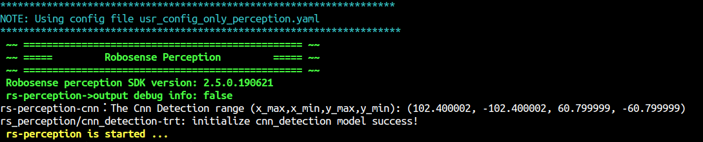

- - -

若打开了感知debug信息开关，则终端会不断输出每一帧的感知结果，如下图所示

- - -


- - -

#### 6.1.4 结果
若在参数配置时send_obstacle_ros设为true，可以通过rviz查看感知结果，在工作空间主目录下执行以下指令
```
rviz -d rviz/perception.rviz 
```
结果如下

- - -


### 6.2  快速启动定位算法
####  6.2.1  配置参数文件名
进入工作空间目录下的config文件夹
```
cd rs_sdk/config
```
打开配置文件usr_config_name.yaml
```
gedit usr_config_name.yaml
```
将参数usr_config_name设置为 usr_config_only_localization.yaml


- - -


- - -


修改完后，回到工作空间主目录rs_sdk
####  6.2.2  添加地图文件
由于定位算法必须结合地图使用，用户需要手动添加所需的地图文件
Robosense的定位算法支持两种地图格式，用户可选择只用gridmap，或两种地图同时使用（不可只用rsmap！）
- gridmap， 文件后缀为 .gridmap
- rsmap， 文件后缀为 .rsmap

**用户可选择购买我司建图软件自行建图，或联系我司技术支持为您建图**
- - -

将gridmap文件和rsmap文件拷贝到 **config/system_config/localization_config** 文件夹下

- - -

- - -
**请不要擅自修改system_config中的任何配置文件！**
- - -

####  6.2.3  配置参数
进入config文件夹里的usr_config文件夹
```
cd config/usr_config/
```
打开参数文件usr_config_only_localization.yaml
```
gedit usr_config_only_localization.yaml
```
- - -
**注意！ YAML文件对缩进的要求十分严格！在配置参数时请勿改变参数的缩进！**
- - -
- - -

**以下为快速启动定位算法的默认参数配置（单雷达）**
- - -
``` yaml
general:                       
  run_localization: true	//若启动定位算法，设为true
  
localization:
    common:
        grid_map: map.gridmap	//gridmap的文件名, map文件应放在/system_config/localization_config文件夹内
        rsmap: map.rsmap	//rsmap的文件名, map文件应放在/system_config/localization_config文件夹内
        localization_mode: 0	//定位模式, 0:使用GPS消息初始化, 下面三个参数无需设置, 默认0即可
        						// 		4: 使用给定的地图坐标xyz进行初始化,需设置下面三个参数. 假设车从地图原点出发, 那么全部设为0即可.若不为原点, 获取地图坐标的方式请参考6.1
        pose_guess_0: 0 // 初始化位置 x 坐标值
    	pose_guess_1: 0 // 初始化位置 y 坐标值
    	pose_guess_2: 0 // 初始化位置 z 坐标值

preprocessing:
  odom:
    speed_unit: 1		//传入的速度单位， 0：m/s 1:km/h 2:mph ，输出速度单位固定为m/s
sensor:
    lidar:
        common:
            msg_source: 2    //雷达消息来源, 1: 雷达驱动 2：rosbag-packets 3:rosbag-点云 4,protobuf-packet 5,protobuf-点云
            send_packets_ros: false	//若希望将雷达原始packets发布到ros上，设为true
            send_points_ros: false	//若希望将雷达原始点云发布到ros上，设为true
        	send_packets_proto: false //若希望将雷达原始packets通过protobuf发出,设为true
            send_points_proto: false //若希望将雷达原始点云通过protobuf发出,设为true
        lidar:
            - driver:
                  include: ../system_config/sensor_config/lidar/middle_lidar/lidar.yaml //根据具体雷达型号，选择相应的雷达yaml配置文件
              ros:
                  ros_recv_points_topic: /rslidar_points		//若雷达消息来源为3，配置正确的接收topic名
                  ros_recv_packets_topic: /rslidar_packets	//若雷达消息来源为2，配置正确的接收topic名
                  ros_send_points_topic: /rslidar_points	//发布原始点云的topic名
                  ros_send_packets_topic: /rslidar_packets	//发布原始雷达packets的topic名
              proto:
				  points_send_port: 60021		//点云发送端口号
				  points_recv_port: 60021		//点云接收端口号
				  points_send_ip: 127.0.0.1		//点云发送地址
                  msop_send_port: 60022			//msop packet 发送端口号	(关于msop packet定义请参考雷达用户手册)
                  msop_recv_port: 60022			//msop packet 接收端口号
                  difop_send_port: 60023		//difop packet 发送端口号     (关于difop packet定义请参考雷达用户手册)
                  difop_recv_port: 60023		//difop packet 接收端口号
                  packets_send_ip: 127.0.0.1	//packet统一发送地址
    imu:
        common:
            msg_source: 2		//IMU消息来源， 1:驱动， 2:ROS， 3：Proto
            send_msg_ros: false		//若希望发送原始IMU数据到ROS，设为true
            send_msg_proto: false	//若希望发送原始IMU数据到Proto，设为true
        ros:
            ros_recv_topic: /imu	//若IMU消息来源为2， 配置正确的接受topic名
            ros_send_topic: /imu //发布原始IMU消息的topic名
        proto:
            proto_send_port: 60011	//发布原始IMU消息的proto的目标端口号
            proto_send_ip: 127.0.0.1	//发布原始IMU消息的proto的目标地址
            proto_recv_port: 60011	//若IMU消息来源为3， 配置正确的接收端口号
    gnss:
    	common:
            msg_source: 2		//GNSS消息来源， 1:驱动， 2:ROS， 3：Proto  
            send_msg_ros: false     //若希望发送原始GNSS数据到ROS，设为true
            send_msg_proto: false	//若希望发送原始GNSS数据到Proto，设为true
    	ros:
            ros_recv_topic: /gnss	//若GNSS消息来源为2， 配置正确的接受topic名  
            ros_send_topic: /gnss	//发布原始GNSS消息的topic名
    	proto:
            proto_send_port: 60012	//发布原始GNSS消息的proto的目标端口号
            proto_send_ip: 127.0.0.1	//发布原始GNSS消息的proto的目标地址
            proto_recv_port: 60012	//若GNSS消息来源为3， 配置正确的接收端口号
	odom:
    	common:
            msg_source: 2		//ODOM消息来源， 1:驱动， 2:ROS， 3：Proto  
            send_msg_ros: false     //若希望发送原始ODOM数据到ROS，设为true
            send_msg_proto: false	//若希望发送原始ODOM数据到Proto，设为true
    	ros:
            ros_recv_topic: /speed	//若ODOM消息来源为2， 配置正确的接受topic名  
            ros_send_topic: /speed	//发布原始ODOM消息的topic名
    	proto:
            proto_send_port: 60013	//发布原始ODOM消息的proto的目标端口号
            proto_send_ip: 127.0.0.1	//发布原始ODOM消息的proto的目标地址
            proto_recv_port: 60013	//若ODOM消息来源为3， 配置正确的接收端口号

result_sender:
	ros:
		localization:                                            
            send_pos_ros: true	//若希望将定位结果发布到ROS，设为true           
            send_map_ros: true	//若希望将地图发布到ROS，设为true
            send_path_ros: true	//若希望将车体轨迹发布到ROS，设为true
		pointcloud:                                               
            send_uncompensated_cloud_ros: true	//若希望将未经过运动补偿的融合点云发布到ROS，设为true                      
            send_compensated_cloud_ros: true	//若希望将经过运动补偿的融合点云发布到ROS，设为true
    proto:
		localization:
            send_pos_proto: false	//若希望通过proto发送定位结果，设为true
            send_pos_proto_port: 60001		//配置proto目标端口号
            send_pos_proto_ip: 192.168.1.255	//配置proto目标地址 
		pointcloud:                          
            send_uncompensated_cloud_proto: false    //使用protobuf发送未经过运动补偿的融合点云
            send_compensated_cloud_proto: false       //使用protobuf发送经过运动补偿的融合点云               
            uncompensated_cloud_proto_port: 60030     //未经过运动补偿的融合点云的发送端口
            compensated_cloud_proto_port: 60031		//经过运动补偿的融合点云的发送端口
            cloud_proto_ip: 127.0.0.1   	//融合点云的统一发送地址
```
- - -
**若为三雷达，只需在参数中sensor中的lidar部分新增两组雷达参数即可,注意缩进!**
```yaml
sensor:
    lidar:
        common:
            msg_source: 2    //雷达消息来源, 1: 雷达驱动 2：rosbag-packets 3:rosbag-点云 4,protobuf-packet 5,protobuf-点云
            send_packets_ros: false	//若希望将雷达原始packets发布到ros上，设为true
            send_points_ros: false	//若希望将雷达原始点云发布到ros上，设为true
        	send_packets_proto: false //若希望将雷达原始packets通过protobuf发出,设为true
            send_points_proto: false //若希望将雷达原始点云通过protobuf发出,设为true
        lidar:
            - driver:
                  include: ../system_config/sensor_config/lidar/middle_lidar/lidar.yaml //根据具体雷达型号，选择相应的雷达yaml配置文件
              ros:
                  ros_recv_points_topic: /middle/rslidar_points		//若雷达消息来源为3，配置正确的接收topic名
                  ros_recv_packets_topic: /middle/rslidar_packets	//若雷达消息来源为2，配置正确的接收topic名
                  ros_send_points_topic: /middle/rslidar_points	//发布原始点云的topic名
                  ros_send_packets_topic: /middle/rslidar_packets	//发布原始雷达packets的topic名
              proto:
				  points_send_port: 60021		//点云发送端口号
				  points_recv_port: 60021		//点云接收端口号
				  points_send_ip: 127.0.0.1		//点云发送地址
                  msop_send_port: 60022			//msop packet 发送端口号	(关于msop packet定义请参考雷达用户手册)
                  msop_recv_port: 60022			//msop packet 接收端口号
                  difop_send_port: 60023		//difop packet 发送端口号     (关于difop packet定义请参考雷达用户手册)
                  difop_recv_port: 60023		//difop packet 接收端口号
                  packets_send_ip: 127.0.0.1	//packet统一发送地址
			- driver:
                  include: ../system_config/sensor_config/lidar/left_lidar/lidar.yaml //根据具体雷达型号，选择相应的雷达yaml配置文件
              ros:
                  ros_recv_points_topic: /left/rslidar_points		//若雷达消息来源为3，配置正确的接收topic名
                  ros_recv_packets_topic: /left/rslidar_packets	//若雷达消息来源为2，配置正确的接收topic名
                  ros_send_points_topic: /left/rslidar_points	//发布原始点云的topic名
                  ros_send_packets_topic: /left/rslidar_packets	//发布原始雷达packets的topic名
              proto:
				  points_send_port: 60024		//点云发送端口号
				  points_recv_port: 60025		//点云接收端口号
				  points_send_ip: 127.0.0.1		//点云发送地址
                  msop_send_port: 60025			//msop packet 发送端口号	(关于msop packet定义请参考雷达用户手册)
                  msop_recv_port: 60025			//msop packet 接收端口号
                  difop_send_port: 60026		//difop packet 发送端口号     (关于difop packet定义请参考雷达用户手册)
                  difop_recv_port: 60026		//difop packet 接收端口号
                  packets_send_ip: 127.0.0.1	//packet统一发送地址
			- driver:
                  include: ../system_config/sensor_config/lidar/right_lidar/lidar.yaml //根据具体雷达型号，选择相应的雷达yaml配置文件
              ros:
                  ros_recv_points_topic: /right/rslidar_points		//若雷达消息来源为3，配置正确的接收topic名
                  ros_recv_packets_topic: /right/rslidar_packets	//若雷达消息来源为2，配置正确的接收topic名
                  ros_send_points_topic: /right/rslidar_points	//发布原始点云的topic名
                  ros_send_packets_topic: /right/rslidar_packets	//发布原始雷达packets的topic名
              proto:
				  points_send_port: 60027		//点云发送端口号
				  points_recv_port: 60027		//点云接收端口号
				  points_send_ip: 127.0.0.1		//点云发送地址
                  msop_send_port: 60028			//msop packet 发送端口号	(关于msop packet定义请参考雷达用户手册)
                  msop_recv_port: 60028			//msop packet 接收端口号
                  difop_send_port: 60029		//difop packet 发送端口号     (关于difop packet定义请参考雷达用户手册)
                  difop_recv_port: 60029		//difop packet 接收端口号
                  packets_send_ip: 127.0.0.1	//packet统一发送地址
                  
```

**rs_sdk目前最多支持6个雷达同时工作. 以此类推, 每多一个雷达,只需增加一组参数即可. **
**注意! 此处配置的雷达数目必须与第四章中标定参数文件中配置的雷达数目一致! 否则会导致错误!**

配置好参数后，回到工作空间主目录rs_sdk
####  6.2.4  启动
- - -
**注意！ 若使用ROS相关功能，请先打开一个终端启动roscore！**
- - -
rs_sdk共有两种启动方式，用户自行选择一种方式启动

- 本地启动

进入在安装&编译步骤中创建的build文件夹
```
cd build/
```
启动程序
```
./rs_sdk_demo
```

- 全局启动

打开bashrc文件(若使用.zsh，打开.zshrc文件)
```
gedit ~/.bashrc
```
将工作空间的build文件夹的绝对路径添加到文件末尾,如下图所示（请按照实际路径填写，图片仅供参考）：

- - -


- - -
source相应的文件
```
source ~/.bashrc
```
完成后， 用户可以在电脑任意位置启动rs_sdk_demo, 无需再进入工作空间的build文件夹内启动

* * *


正常启动后，会出现以下界面， 表示正在加载地图，加载时间会根据地图大小等因素变化，请用户耐心等待
- - -
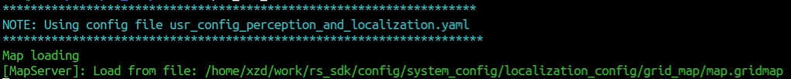
- - -
出现以下界面时，表示地图已经加载成功
- - -
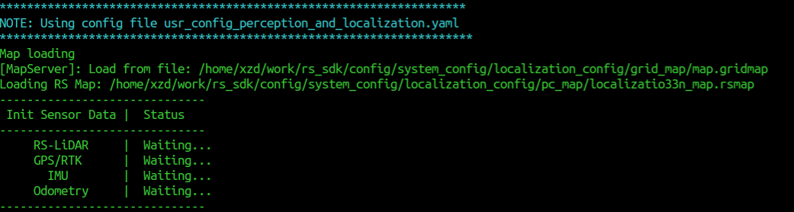
- - -
此时也可在rviz中看到加载好的地图，在工作空间主目录下执行以下指令 （参数配置时send_map_ros需设为true）
```
rviz -d rviz/localization.rviz
```

gridmap:

- - -

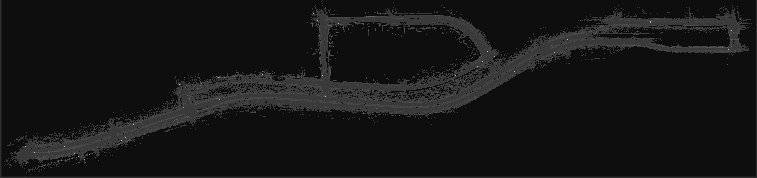


- - -
rsmap:

- - -


- - -
当Lidar, GPS/RTK, IMU这三种传感器的状态都为Ready时, 定位程序进入位姿初始化阶段如下图所示：

- - -


- - -
**注意, 使用离线播放rosbag文件的形式运行定位程序, 切记在进入位姿初始化阶段时立即按下空格键, 暂停bag播放, 等到位姿初始化完成之后再继续播放bag文件!**

- - -

如果是实时采集传感器数据进行定位, 使用单点GPS的车辆在初始化过程中尽量保持车身静止。使用RTK并且发布运动学信息的车辆允许在初始化过程中移动。

- - -

完成位姿初始之后, 如果继续接收到传感器消息(再次按下空格键播包), 定位程序会进入正常定位阶段，此时终端显示如下。

- - -


- - -
#### 6.2.5 结果
若在参数配置时send_pos_ros设为true，且点云发送部分也设为true，可以通过rviz查看定位结果及点云，在工作空间主目录下执行以下指令
```
rviz -d rviz/localization.rviz 
```
结果如下
- - -


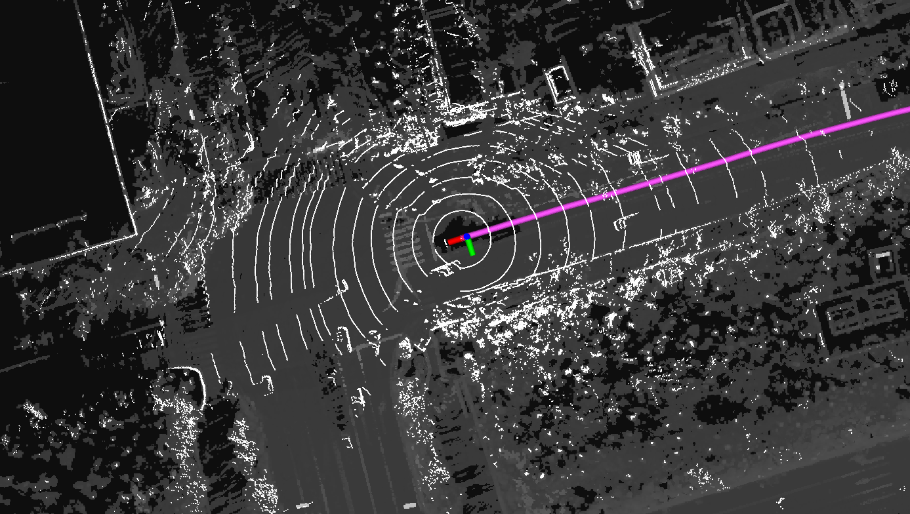


- - -

### 6.3  快速启动感知算法&定位算法
####  6.3.1  配置参数文件名
进入工作空间目录下的config文件夹
```
cd rs_sdk/config
```
打开配置文件usr_config_name.yaml
```
gedit usr_config_name.yaml
```
将参数usr_config_name设置为 usr_config_perception_and_localization.yaml

- - -

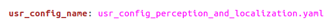

- - -

修改完后，回到工作空间主目录rs_sdk
####  6.3.2  添加地图文件
由于定位算法必须结合地图使用，用户需要手动添加所需的地图文件
Robosense的定位算法支持两种地图格式，用户可选择只用gridmap，或两种地图同时使用（不可只用rsmap！）
- gridmap， 文件后缀为 .gridmap
- rsmap， 文件后缀为 .rsmap

- - -
**用户可选择购买我司建图软件自行建图，或联系我司技术支持为您建图**
- - -

将gridmap文件和rsmap文件拷贝到 **config/system_config/localization_config** 文件夹下

- - -

- - -
**请不要擅自修改system_config中的任何配置文件！**

- - -


####  6.3.3  配置参数
进入config文件夹里的usr_config文件夹
```
cd config/usr_config/
```
打开参数文件usr_config_perception_and_localization.yaml
```
gedit usr_config_perception_and_localization.yaml
```
- - -
**注意！ YAML文件对缩进的要求十分严格！在配置参数时请勿改变参数的缩进！**
- - -

- - -

**以下为快速启动定位加感知算法的默认参数配置（单雷达）**

- - -
``` yaml
general:                   
    run_localization: true	//若启动定位算法，设为true
	run_perception: true	//若启动感知算法，设为true
  
localization:
    common:
        grid_map: map.gridmap	//gridmap的文件名, map文件应放在/system_config/localization_config文件夹内
        rsmap: map.rsmap	//rsmap的文件名, map文件应放在/system_config/localization_config文件夹内
        localization_mode: 0	//定位模式, 0:使用GPS消息初始化, 下面三个参数无需设置, 默认0即可
        						// 		4: 使用给定的地图坐标xyz进行初始化,需设置下面三个参数. 假设车从地图原点出发, 那么全部设为0即可.若不为原点, 获取地图坐标的方式请参考6.1
        pose_guess_0: 0 // 初始化位置 x 坐标值
    	pose_guess_1: 0 // 初始化位置 y 坐标值
    	pose_guess_2: 0 // 初始化位置 z 坐标值
perception:
    common:
    	with_debug_info: false	//若希望运行时感知的debug信息输出到终端显示,设为true (建议设为false，否则其他的错误信息会被刷掉) 
        
preprocessing:
  odom:
    speed_unit: 1		//传入的速度单位， 0：m/s 1:km/h 2:mph ，输出速度单位固定为m/s
    
sensor:
    lidar:
        common:
            msg_source: 2    //雷达消息来源, 1: 雷达驱动 2：rosbag-packets 3:rosbag-点云 4,protobuf-packet 5,protobuf-点云
            send_packets_ros: false	//若希望将雷达原始packets发布到ros上，设为true
            send_points_ros: false	//若希望将雷达原始点云发布到ros上，设为true
        	send_packets_proto: false //若希望将雷达原始packets通过protobuf发出,设为true
            send_points_proto: false //若希望将雷达原始点云通过protobuf发出,设为true
        lidar:
            - driver:
                  include: ../system_config/sensor_config/lidar/middle_lidar/lidar.yaml //根据具体雷达型号，选择相应的雷达yaml配置文件
              ros:
                  ros_recv_points_topic: /rslidar_points		//若雷达消息来源为3，配置正确的接收topic名
                  ros_recv_packets_topic: /rslidar_packets	//若雷达消息来源为2，配置正确的接收topic名
                  ros_send_points_topic: /rslidar_points	//发布原始点云的topic名
                  ros_send_packets_topic: /rslidar_packets	//发布原始雷达packets的topic名
              proto:
				  points_send_port: 60021		//点云发送端口号
				  points_recv_port: 60021		//点云接收端口号
				  points_send_ip: 127.0.0.1		//点云发送地址
                  msop_send_port: 60022			//msop packet 发送端口号	(关于msop packet定义请参考雷达用户手册)
                  msop_recv_port: 60022			//msop packet 接收端口号
                  difop_send_port: 60023		//difop packet 发送端口号     (关于difop packet定义请参考雷达用户手册)
                  difop_recv_port: 60023		//difop packet 接收端口号
                  packets_send_ip: 127.0.0.1	//packet统一发送地址
    imu:
        common:
            msg_source: 2		//IMU消息来源， 1:驱动， 2:ROS， 3：Proto
            send_msg_ros: false		//若希望发送原始IMU数据到ROS，设为true
            send_msg_proto: false	//若希望发送原始IMU数据到Proto，设为true
        ros:
            ros_recv_topic: /imu	//若IMU消息来源为2， 配置正确的接受topic名
            ros_send_topic: /imu //发布原始IMU消息的topic名
        proto:
            proto_send_port: 60011	//发布原始IMU消息的proto的目标端口号
            proto_send_ip: 127.0.0.1	//发布原始IMU消息的proto的目标地址
            proto_recv_port: 60011	//若IMU消息来源为3， 配置正确的接收端口号
    gnss:
    	common:
            msg_source: 2		//GNSS消息来源， 1:驱动， 2:ROS， 3：Proto  
            send_msg_ros: false     //若希望发送原始GNSS数据到ROS，设为true
            send_msg_proto: false	//若希望发送原始GNSS数据到Proto，设为true
    	ros:
            ros_recv_topic: /gnss	//若GNSS消息来源为2， 配置正确的接受topic名  
            ros_send_topic: /gnss	//发布原始GNSS消息的topic名
    	proto:
            proto_send_port: 60012	//发布原始GNSS消息的proto的目标端口号
            proto_send_ip: 127.0.0.1	//发布原始GNSS消息的proto的目标地址
            proto_recv_port: 60012	//若GNSS消息来源为3， 配置正确的接收端口号
	odom:
    	common:
            msg_source: 2		//ODOM消息来源， 1:驱动， 2:ROS， 3：Proto  
            send_msg_ros: false     //若希望发送原始ODOM数据到ROS，设为true
            send_msg_proto: false	//若希望发送原始ODOM数据到Proto，设为true
    	ros:
            ros_recv_topic: /speed	//若ODOM消息来源为2， 配置正确的接受topic名  
            ros_send_topic: /speed	//发布原始ODOM消息的topic名
    	proto:
            proto_send_port: 60013	//发布原始ODOM消息的proto的目标端口号
            proto_send_ip: 127.0.0.1	//发布原始ODOM消息的proto的目标地址
            proto_recv_port: 60013	//若ODOM消息来源为3， 配置正确的接收端口号

result_sender:
	ros:
		localization:                                            
            send_pos_ros: true	//若希望将定位结果发布到ROS，设为true           
            send_map_ros: true	//若希望将地图发布到ROS，设为true
            send_path_ros: true	//若希望将车体轨迹发布到ROS，设为true
    	perception:                                              
			send_obstacle_ros: true		//若希望将感知结果(障碍物)发送到ros，设为true    
            send_groundpoint_ros: true  //若希望将感知结果(地面点)发送到ros，设为true    
            send_freespace_ros: true	//若希望将感知结果(可通行区域)发送到ros，设为true  
		pointcloud:                                               
            send_uncompensated_cloud_ros: false	//若希望将未经过运动补偿的融合点云发布到ROS，设为true                      
            send_compensated_cloud_ros: false	//若希望将经过运动补偿的融合点云发布到ROS，设为true
    proto:
		localization:
            send_pos_proto: false	//若希望通过proto发送定位结果，设为true
            send_pos_proto_port: 60001		//配置proto目标端口号
            send_pos_proto_ip: 127.0.0.1  	//配置proto目标地址       
        perception:
      		send_obstacle_proto: false		//若希望通过protobuf发送感知结果，设为true          
      		send_obstacle_proto_port: 60000		//目标的端口号
      		send_obstacle_proto_ip: 127.0.0.1  		//目标地址
            
		pointcloud:                          
            send_uncompensated_cloud_proto: false    //使用protobuf发送未经过运动补偿的融合点云
            send_compensated_cloud_proto: false       //使用protobuf发送经过运动补偿的融合点云               
            uncompensated_cloud_proto_port: 60030     //未经过运动补偿的融合点云的发送端口
            compensated_cloud_proto_port: 60031		//经过运动补偿的融合点云的发送端口
            cloud_proto_ip: 127.0.0.1   	//融合点云的统一发送地址
                             
```
- - -
**若为三雷达，只需在参数中sensor中的lidar部分新增两组雷达参数即可,注意缩进!**
```yaml
sensor:
    lidar:
        common:
            msg_source: 2    //雷达消息来源, 1: 雷达驱动 2：rosbag-packets 3:rosbag-点云 4,protobuf-packet 5,protobuf-点云
            send_packets_ros: false	//若希望将雷达原始packets发布到ros上，设为true
            send_points_ros: false	//若希望将雷达原始点云发布到ros上，设为true
        	send_packets_proto: false //若希望将雷达原始packets通过protobuf发出,设为true
            send_points_proto: false //若希望将雷达原始点云通过protobuf发出,设为true
        lidar:
            - driver:
                  include: ../system_config/sensor_config/lidar/middle_lidar/lidar.yaml //根据具体雷达型号，选择相应的雷达yaml配置文件
              ros:
                  ros_recv_points_topic: /middle/rslidar_points		//若雷达消息来源为3，配置正确的接收topic名
                  ros_recv_packets_topic: /middle/rslidar_packets	//若雷达消息来源为2，配置正确的接收topic名
                  ros_send_points_topic: /middle/rslidar_points	//发布原始点云的topic名
                  ros_send_packets_topic: /middle/rslidar_packets	//发布原始雷达packets的topic名
              proto:
				  points_send_port: 60021		//点云发送端口号
				  points_recv_port: 60021		//点云接收端口号
				  points_send_ip: 127.0.0.1		//点云发送地址
                  msop_send_port: 60022			//msop packet 发送端口号	(关于msop packet定义请参考雷达用户手册)
                  msop_recv_port: 60022			//msop packet 接收端口号
                  difop_send_port: 60023		//difop packet 发送端口号     (关于difop packet定义请参考雷达用户手册)
                  difop_recv_port: 60023		//difop packet 接收端口号
                  packets_send_ip: 127.0.0.1	//packet统一发送地址
			- driver:
                  include: ../system_config/sensor_config/lidar/left_lidar/lidar.yaml //根据具体雷达型号，选择相应的雷达yaml配置文件
              ros:
                  ros_recv_points_topic: /left/rslidar_points		//若雷达消息来源为3，配置正确的接收topic名
                  ros_recv_packets_topic: /left/rslidar_packets	//若雷达消息来源为2，配置正确的接收topic名
                  ros_send_points_topic: /left/rslidar_points	//发布原始点云的topic名
                  ros_send_packets_topic: /left/rslidar_packets	//发布原始雷达packets的topic名
              proto:
				  points_send_port: 60024		//点云发送端口号
				  points_recv_port: 60025		//点云接收端口号
				  points_send_ip: 127.0.0.1		//点云发送地址
                  msop_send_port: 60025			//msop packet 发送端口号	(关于msop packet定义请参考雷达用户手册)
                  msop_recv_port: 60025			//msop packet 接收端口号
                  difop_send_port: 60026		//difop packet 发送端口号     (关于difop packet定义请参考雷达用户手册)
                  difop_recv_port: 60026		//difop packet 接收端口号
                  packets_send_ip: 127.0.0.1	//packet统一发送地址
			- driver:
                  include: ../system_config/sensor_config/lidar/right_lidar/lidar.yaml //根据具体雷达型号，选择相应的雷达yaml配置文件
              ros:
                  ros_recv_points_topic: /right/rslidar_points		//若雷达消息来源为3，配置正确的接收topic名
                  ros_recv_packets_topic: /right/rslidar_packets	//若雷达消息来源为2，配置正确的接收topic名
                  ros_send_points_topic: /right/rslidar_points	//发布原始点云的topic名
                  ros_send_packets_topic: /right/rslidar_packets	//发布原始雷达packets的topic名
              proto:
				  points_send_port: 60027		//点云发送端口号
				  points_recv_port: 60027		//点云接收端口号
				  points_send_ip: 127.0.0.1		//点云发送地址
                  msop_send_port: 60028			//msop packet 发送端口号	(关于msop packet定义请参考雷达用户手册)
                  msop_recv_port: 60028			//msop packet 接收端口号
                  difop_send_port: 60029		//difop packet 发送端口号     (关于difop packet定义请参考雷达用户手册)
                  difop_recv_port: 60029		//difop packet 接收端口号
                  packets_send_ip: 127.0.0.1	//packet统一发送地址
                  
```

**rs_sdk目前最多支持6个雷达同时工作. 以此类推, 每多一个雷达,只需增加一组参数即可. **
**注意! 此处配置的雷达数目必须与第四章中标定参数文件中配置的雷达数目一致! 否则会导致错误!**

配置好参数后，回到工作空间主目录rs_sdk
#### 6.3.4  启动
- - -
**注意！ 若使用ROS相关功能，请先打开一个终端启动roscore！**
- - -
rs_sdk共有两种启动方式，用户自行选择一种方式启动

- 本地启动

进入在安装&编译步骤中创建的build文件夹
```
cd build/
```
启动程序 
```
./rs_sdk_demo
```

- 全局启动

打开bashrc文件(若使用.zsh，打开.zshrc文件)
```
gedit ~/.bashrc
```
将工作空间的build文件夹的绝对路径添加到文件末尾,如下图所示（请按照实际路径填写，图片仅供参考）：
- - -


- - -
source相应的文件
```
source ~/.bashrc
```
完成后， 用户可以在电脑任意位置启动rs_sdk_demo, 无需再进入工作空间的build文件夹内启动

* * *

正常启动后，会出现以下界面， 表示正在加载地图，加载时间会根据地图大小等因素变化，请用户耐心等待
- - -

- - -
出现以下界面时，表示地图已经加载成功
- - -

- - -
此时也可在rviz中看到加载好的地图，在工作空间主目录下执行以下指令 （参数配置时send_map_ros需设为true）
```
rviz -d rviz/perception_and_localization.rviz 
```

gridmap:
- - -


- - -
rsmap:
- - -


- - -
当Lidar, GPS/RTK, IMU这三种传感器的状态都为Ready时, 定位程序进入位姿初始化阶段如下图所示：

- - -

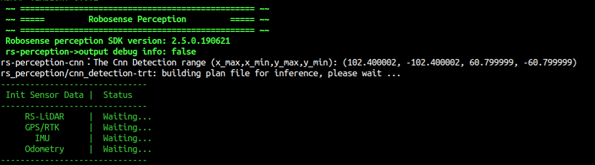

- - -
**注意, 使用离线播放rosbag文件的形式运行定位程序, 切记在进入位姿初始化阶段时立即按下空格键, 暂停bag播放, 等到位姿初始化完成之后再继续播放bag文件!**
- - -

如果是实时采集传感器数据进行定位, 使用单点GPS的车辆在初始化过程中尽量保持车身静止。使用RTK并且发布运动学信息的车辆允许在初始化过程中移动。
- - -

完成位姿初始之后, 如果继续接收到传感器消息(再次按下空格键播包), 定位程序会进入正常定位阶段，此时终端显示如下。

- - -


- - -
#### 6.3.5 结果
若在参数配置时send_pos_ros，send_obstacle_ros设为true，且点云发送部分也设为true，可以通过rviz查看定位感知结果及点云，在工作空间主目录下执行以下指令
```
rviz -d rviz/perception_and_localization.rviz 
```
结果如下
- - -
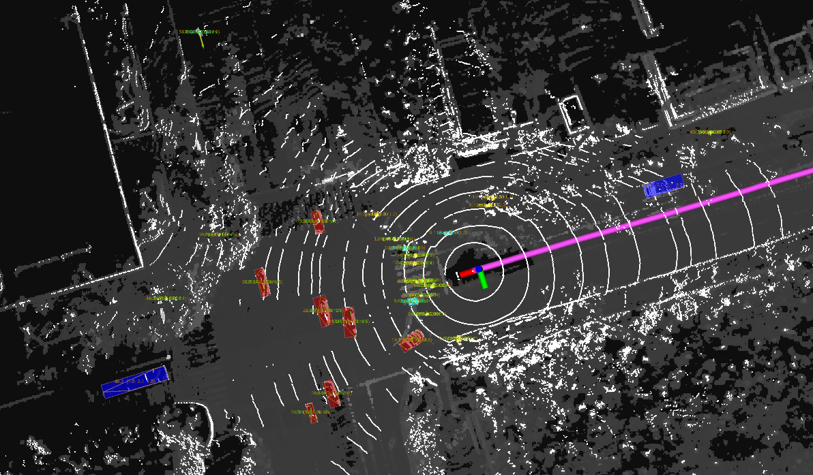

- - -


## 7. 使用进阶


### 7.1 获取地图任意位置坐标
若想知道地图某一点的坐标, 首先启动定位算法. (没有雷达数据没事,初始化失败也没事, 启动后地图就会发布出来)


上图表示正在加载地图


此时地图已加载完成并发布

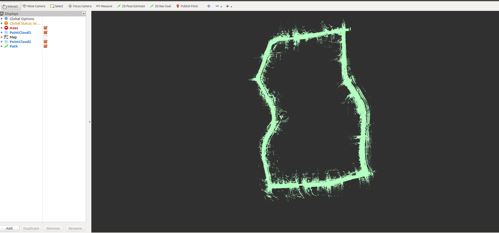

```
rviz -d rviz/localization.rviz
```

使用前面提到的指令打开rviz配置文件即可看到地图


此时新建一个终端输入以上指令, 订阅 /initialpose这个topic


回到rviz界面, 在上方的工具栏可以看到一个2D Pose Estimate的按钮, 选择这个按钮, 然后在地图任意位置点击


终端内即可收到点击处的位置消息. 里面的position: x,y,z就是您点击位置处的地图坐标. 


- - -
### 7.2 二次开发
对于技术水平较强的用户，可自行参考每个模块具体的介绍文档及API接口手册进行二次开发。

- - -

**感知模块**
- - -
具体介绍请参考：  [README_CN](rs_perception/README_CN.md)

- - -

**定位模块**

- - -
具体介绍请参考：  [README_CN](rs_localization/README_CN.md)

- - -

API接口介绍：  [API](rs_localization/API.md)


- - -
**传感器模块**

- - -
API接口介绍： [API](rs_sensor/API.md)

## 8. 常见错误
本节列举出了rs_sdk常见的报错提醒及解决方法


- - -

(1) KEY_NOT_FOUND

- - -


- - -
原因： 1， 未插上USB KEY 		2,未执行key的安装脚本 

- - -

解决办法： 停止程序， 插上USB-KEY，等待5~10秒后重新启动程序， 或参考依赖包安装指导，重新安装key

- - -
(2) KEY_FEATURE_NOT_FOUND


- - -

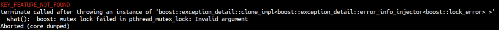

- - -
原因： 速腾聚创的定位算法与感知算法的授权是相互独立的。 若用户只获得了其中一款算法的授权， 而尝试启动另一款算法， 则会报错。

- - -
解决办法： 修改usr_config, 只启动获得了授权的算法。

- - -
(3) Wrong perception mode

- - -


- - -
原因： 当perception mode设置为1时表示需要获取定位的结果来进行感知， 倘若此时run_localization设为false， 表示不启动定位算法， 则会报错。
- - -
解决办法： 将perception mode设置为0，或者将run_localization设为true

- - -
(4)Localization


- - -
原因： 在运行定位算法时有时终端界面会弹出此类报错，原因是因为数据时间戳不够准确，或是出现堵塞， 并不影响程序正常运行。
- - -
解决办法： 换高质量的数据

(5)Preprocessing Timeout


- - -

原因：预处理模块经过一定时间还未收到数据。 可能原因为： 1， 在线运行，传感器未打开，或波特率等配置错误，导致无数据。 2， 离线运行， 未开始播rosbag包， 或proto端口设置错误，未收到数据

- - -

解决办法： 找出数据超时的具体原因并解决

(6)No earlier state


- - -

原因：离线播rosbag包运行定位时可能会出现这个问题， 原因是ros中有可能缓存了一些数据， 而第二次播包时的数据时间戳早于ros中缓存的数据。 

- - -

解决办法： 重启roscore，再运行程序即可

## 9. 联系方式

- 田工: zhtian@robosense.cn
- 吴工: ghwu@robosense.cn

