# **Robosense SDK User Guide**
- V 1.2.0 beta
- [1. Introduction](#1-introduction)  
- [2. Hardware requirement and Software dependency](#2-hardware-requirement-and-software-dependency)   
    - [2.1. Hardware requirement](#21-hardware-requirement)      
    - [2.2. Software dependency](#22-software-dependency) 
- [3. Install and Compile](#3-install-and-compile)    
- [4. Calibration](#4-calibration)        
    - [4.1 LiDAR calibration](#41-lidar-calibration)        
    - [4.2 Other calibration](#42-other-calibration)
- [5.  Quick Start](#5--quick-start)
    - [5.1 Quick start the perception algorithm](#51-quick-start-the-perception-algorithm)
        - [5.1.1  Set the name of user config file](#511--set-the-name-of-user-config-file)
        - [5.1.2 Set the parameters](#512-set-the-parameters)
        - [5.1.3  Run](#513--run)
        - [5.1.4 Result](#514-result)
    - [5.2  Quick start the localization algorithm](#52--quick-start-the-localization-algorithm)
        - [5.2.1  Set the name of user config file](#521--set-the-name-of-user-config-file)
        - [5.2.2  Add the map file](#522--add-the-map-file)
        - [5.2.3  Set the parameters](#523--set-the-parameters)
        - [5.2.4  Run](#524--run)
        - [5.2.5 Result](#525-result)
    - [5.3 Quick start the perception algorithm & localization algorithm](#53-quick-start-the-perception-algorithm--localization-algorithm)
        - [5.3.1  Set the name of user config file](#531--set-the-name-of-user-config-file)
        - [5.3.2  Add the map file](#532--add-the-map-file)
        - [5.3.3  Set the parameters](#533--set-the-parameters)
        - [5.3.4  Run](#534--run)
        - [5.3.5 Result](#535-result)
- [6. Advanced](#6-advanced)
- [7. Common Error](#7-common-error)

## 1. Introduction
rs_sdk is the workspace for LiDAR algorithm system of Robosense.

The SDK contains：

- Perception Algorithm: **rs_perception**

- Localization Algorithm: **rs_localization**

- LiDAR driver module: **rs_lidar**

- Sensor manager module： **rs_sensor**

- Preprocessing module: **rs_preprocessing**

- Common module: **rs_common**


- - -
**User can use the specific algorithm base on the entitlement**


## 2. Hardware requirement and Software dependency
### 2.1. Hardware requirement

- X86 platform (laptop、PC or IPC, GPU>= Nvidia GTX1060）)

- Arm platform ( Nvidia Jetson Tx2 or better device（e.g. Nvidia Jetson AGX Xavier）)


**NOTE：**

- Robosense Perception SDK is developed under **Linux Ubuntu 16.04 64 OS**, supported by **ROS kinetic**, so the same environment is recommonded.  **windows is not supported**；
- Since the communication module depends on the hardware, **Virtual machine is not supported**；
- **SDK does not depend on ROS** ，but ROS can make it easier to record bag or play bag, while you can also use **ros-rviz** to watch the result. So it **recommonded to install ROS-Kinetic-FULL**

### 2.2. Software dependency
**Before starting, please make sure the following softwares are well installed**
- cmake (at least version3.5)
- PCL 1.7.1 or higher version
- Boost 1.54 or higher version
- Eigen 3.x or higher version
- Protobuf 2.6.1 
- yaml 0.5.x

- - -

**If using perception module**
- OpenCV 2.x or 3.x
- CUDA 10.0 package
  - GPU driver（>=410.48）
  - CUDA 10.0
  - cudnn - cuda10
  - TensorRT - cuda10


- - -
**The details for dependencies installation can be found in the dependency installation instructment**
- - -
 


## 3. Install and Compile
First, please excute the following command to extract the sdk package
```
$sudo tar -xf rs_sdk_xxxx.tar.gz
```
After that, enter the worksapce, add the excute permission on install_dependency.sh and excute it.
```
$sudo chmod a+x install_dependency.sh
$sudo ./install_dependency.sh
```
Then, open the CmakeLists.txt file under the main directory
```
gedit CMakeLists.txt
```
For the users who buy both localization algorithm and perception algorithm, please make sure that the third line and forth line of the CmakeList.txt are both set to TRUE, as the following image shows
- - -
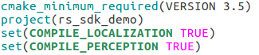
- - -
For the users who only buy perception algorithm, please make sure the third line is set to FALSE and the forth line is set to TRUE, as the image shows
- - -
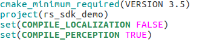
- - -
For the users who only buy localization algorithm, please make sure the third line is set to TRUE and the forth line is set to TRUE, as the image shows
- - -
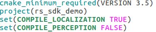
- - -
**Except this, please DO NOT modify and code in CMakeLists.txt!**
- - -
 Close the CMakeLists.txt file and create a "build" folder under the main directory, enter the folder
```
mkdir build
cd build/
```
Compile the program
```
cmake ../
make -j
```
**If compile failed, please check the environment and dependencies first. If the problem can not be solved, please contact the technical support!**

- - -
**NOTE! If the project path is changed after compilation, user need to compile again!**
- - -

## 4. Calibration
After compilation, the next thing to do is the calibration. The definition of the axis is shown below.

- - -
X point to the front of the car, Y point to the left of the car, Z point to the sky, the original point is teh geometric center of the orthographic bounding box in the center of the rear wheel of the vehicle on the ground, that is, the origin is on the ground as shown in the following figure: 

- - -

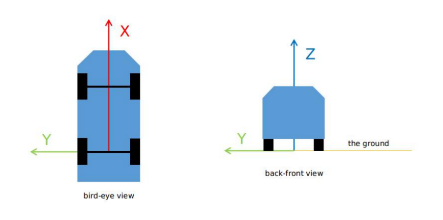

- - -
Enter the usr_config folder and open the calibration.yaml file
```
cd config/usr_config/
gedit calibration.yaml
```

**NOTE: The accuracy of the calibration will directly affect the accuracy of perception algorithm and localization algorithm!**

### 4.1 LiDAR calibration
**User can choose to buy our calibration application to do calibration by yourself, or contact our technical support to do calibration for you.**

- - -
After calibration, please fill the correct calibration values in calibration.yaml, this is the example for one LiDAR:
```
lidar:  
  - parent_frame_id: /base_link  
    frame_id: /middle_lidar 
    x: 0
    y: 0 
    z: 0 
    roll: 0
    pitch: 0 
    yaw: 0
```

This is the example for three LiDAR:
```
lidar:  
  - parent_frame_id: /base_link  
    frame_id: /middle_lidar 
    x: 0
    y: 0 
    z: 0 
    roll: 0 
    pitch: 0 
    yaw: 0 

  - parent_frame_id: /middle_lidar
    frame_id: /left_lidar 
    x: 0
    y: 0
    z: 0
    roll: 0
    pitch: 0
    yaw: 0

  - parent_frame_id: /middle_lidar
    frame_id: /right_lidar 
    x: 0
    y: 0
    z: 0
    roll: 0
    pitch: 0
    yaw: 0
```
### 4.2 Other calibration
If use localization algorithm, user also need to do calibration for other sensors
``` 
imu: 
  parent_frame_id: /base_link 
  frame_id: /imu 
  x: 0 
  y: 0 
  z: 0 
  roll: 0 
  pitch: 0 
  yaw: 0 
 
gnss: 
  parent_frame_id: /base_link 
  frame_id: /gnss 
  x: 0 
  y: 0 
  z: 0 
  roll: 0 
  pitch: 0 
  yaw: 0 
 
odom: 
  parent_frame_id: /base_link 
  frame_id: /odom 
  x: 0 
  y: 0 
  z: 0 
  roll: 0 
  pitch: 0 
  yaw: 0 
```

## 5.  Quick Start
**After calibration, now user can start the program**
**Note: Robosense use USB Key to do entitlement for correspond algorithm. User must keep the USB KEY with correct entitlement inserting in the computer to run the correspond algorithm!**
- For users who only buy perception module, please refer to 5.1--Quick start the perception algorithm
- For users who only buy localization module, please refer to 5.2--Quick start the localization algorithm
- For users who buy both localization and perception module, please refer to 5.3--Quick start the localization algorithm and perception algorithm

### 5.1 Quick start the perception algorithm
####  5.1.1  Set the name of user config file
Enter the condig folder under the main directory
```
cd rs_sdk/config
```
Open usr_config_name.yaml
```
gedit usr_config_name.yaml
```
Set the value of usr_config_name to **usr_config_only_perception.yaml**

- - -

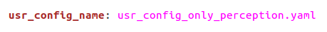

- - -


#### 5.1.2 Set the parameters
Enter the usr_config folder inside the config folder
```
cd usr_config/
```
Open the file *usr_config_only_perception.yaml*
```
gedit usr_config_only_perception.yaml
```

- - -
**NOTE! YAML has strict requirements for indentation! Please DO NOT change the indentation of parameters when configuring the parameters.**
- - -

**The following is the default configuration for starting the perception algorithm(one LiDAR)**

- - -
``` yaml
general:                   
    run_perception: true	##If run perception algorithm, set to true
  
perception:
    common:
    	with_debug_info: false	##If want to print out the debug info on the terminal while perception running, set to true (recommond to set to false, otherwise the error information from other modules may be ignored)
    
sensor:
    lidar:
        common:
            msg_source: 2    ##LiDAR message source, 1: LiDAR Driver 2: ROS bag packets 3: ROS bag points
            send_packets_ros: false	##If publish the original packets on ROS, set to true
            send_points_ros: false	##If publish the original points on ROS, set to true
        lidar:
            - driver:
                  include: ../system_config/sensor_config/lidar/middle_lidar/lidar.yaml 	##Base on the specific LiDAR type, choose the correspond LiDAR yaml config file
              ros:
                  ros_recv_points_topic: /rslidar_points		##If the LiDAR message source is 3, set the correct points subscribe topic name
                  ros_recv_packets_topic: /rslidar_packets	##If the LiDAR message source is 2, set the correct packets subscribe topic name
                  ros_send_points_topic: /rslidar_points	##The topic to publish the original points
                  ros_send_packets_topic: /rslidar_packets	##The topic to publish the original packets

result_sender:
	ros:
    	perception:                                              
      		send_obstacle_ros: true		##If want to publish the perception result to ROS, set to true        
    	pointcloud:                                               
      		send_uncompensated_cloud_ros: false	##If want to publish the fusion points without the motion correct on ROS, set to true
      		send_compensated_cloud_ros: false	##If want to publish the fusion points with the motion correct on ROS, set to true
	proto:
    	perception:
      		send_obstacle_proto: false		##If want the send the perception result through Protobuf, set to true         
      		send_obstacle_proto_port: 60000		##The destination port number 
      		send_obstacle_proto_ip: 192.168.1.255		##The destination IP address
```

- - -
**If use three LiDAR, please replace the sensor-lidar part above with the following : **
```yaml
sensor:
    lidar:
        common:
            msg_source: 2    
            send_packets_ros: false	
            send_points_ros: false	
        lidar:
            - driver:
                  include: ../system_config/sensor_config/lidar/middle_lidar/lidar.yaml 
              ros:
                  ros_recv_points_topic: /middle/rslidar_points		
                  ros_recv_packets_topic: /middle/rslidar_packets	
                  ros_send_points_topic: /middle/rslidar_points		
                  ros_send_packets_topic: /middle/rslidar_packets	
			- driver:
                  include: ../system_config/sensor_config/lidar/left_lidar/lidar.yaml 
              ros:
                  ros_recv_points_topic: /left/rslidar_points		
                  ros_recv_packets_topic: /left/rslidar_packets		
                  ros_send_points_topic: /left/rslidar_points		
                  ros_send_packets_topic: /left/rslidar_packets		
			- driver:
                  include: ../system_config/sensor_config/lidar/right_lidar/lidar.yaml 
              ros:
                  ros_recv_points_topic: /right/rslidar_points		
                  ros_recv_packets_topic: /right/rslidar_packets	 
                  ros_send_points_topic: /right/rslidar_points		
                  ros_send_packets_topic: /right/rslidar_packets	
                  
```


####  5.1.3  Run

- - -
**NOTE！ If use ROS related functions, please open a new terminal and start roscore first!**
- - -

There are two ways to run rs_sdk, user can choose any one of them.
- Local run

 Enter the "build" folder
```
cd build/
```
run program
```
./rs_sdk_demo
```

- Global run

Open the bashrc file (if use zsh, open zshrc file)
```
gedit ~/.bashrc
```
Add the absolute path of "build" folder at the end of the file, as shown below(the figure is just an example, please fill with the actual path)：

- - -


- - -

source the file
```
source ~/.bashrc
```
After that, user can run rs_sdk_demo anywhere in the computer, no need to enter the "build" file.

* * *

After the program is started, if the following interface appears, which means the perception algorithm is started. 
- - -

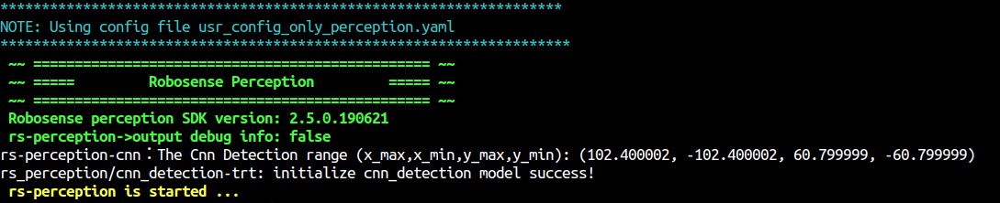

- - -

If the with_debug_info is set to true, the terminal will keep printing the perception debug info of every frame.

- - -

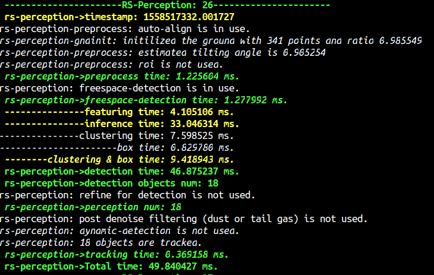

- - -

#### 5.1.4 Result
If send_obstacle_ros is set to true, user can use rviz to check the perception result. Excute the following command under the main directory of rs_sdk.
```
rviz -d rviz/perception.rviz 
```

- - -


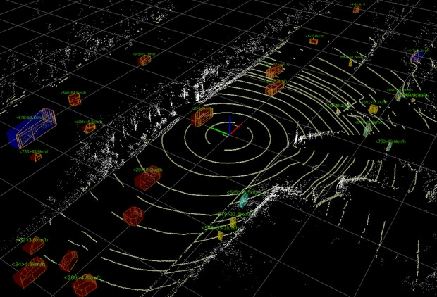


### 5.2  Quick start the localization algorithm
####  5.2.1  Set the name of user config file
Enter the condig folder under the main directory
```
cd rs_sdk/config
```
Open usr_config_name.yaml
```
gedit usr_config_name.yaml
```
Set the value of usr_config_name to **usr_config_only_localization.yaml**

- - -

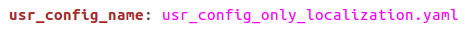

- - -

####  5.2.2  Add the map file
Since the localization algorithm must run with the corresponding map, user need to add the map file manually.
Robosense localization algorithm support two types of map. User can choose to only use gridmap, or use two map at the same time.(CAN NOT only use rsmap!)

- gridmap， file end with .gridmap
- rsmap， file end with .rsmap

**User can buy our application to build map by yourself, or connect us to build the map for you.**
- - -
Copy the gridmap file and rsmap file to      **config/system_config/localization_config**


- - -
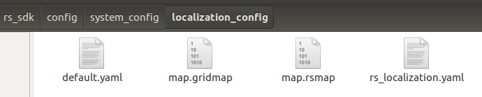
- - -
**Please DO NOT modify any files in system_config**
- - -

####  5.2.3  Set the parameters
Enter the usr_config folder inside the config folder
```
cd usr_config/
```
Open the file *usr_config_only_localization.yaml*
```
gedit usr_config_only_localization.yaml
```

- - -
**NOTE! YAML has strict requirements for indentation! Please DO NOT change the indentation of parameters when configuring the parameters.**
- - -

**The following is the default configuration for starting the localization algorithm(one LiDAR)**
- - -
``` yaml
general:                       
  run_localization: true	##If run perception algorithm, set to true
  
localization:
    common:
        send_localization_freq: 30   ##The frequency of localization algorithm, need to be lower than the highest frequency of sensors.
        grid_map: map.gridmap	##Name of the gridmap file
        rsmap: map.rsmap	##Name of the rsmap file
        map_frame_id: map	##The frame id of the map message
        
preprocessing:
  odom:
    speed_unit: 1           ## input speed unit 0:m/s 1:km/h 2:mph, output is m/s

sensor:
    lidar:
        common:
            msg_source: 2    ##LiDAR message source, 1: LiDAR Driver 2: ROS bag packets 3: ROS bag points
            send_packets_ros: false	##If publish the original packets on ROS, set to true
            send_points_ros: false	##If publish the original points on ROS, set to true
        lidar:
            - driver:
                  include: ../system_config/sensor_config/lidar/middle_lidar/lidar.yaml 	##Base on the specific LiDAR type, choose the correspond LiDAR yaml config file
              ros:
                  ros_recv_points_topic: /rslidar_points	##If the LiDAR message source is 3, set the correct points subscribe topic name
                  ros_recv_packets_topic: /rslidar_packets	##If the LiDAR message source is 2, set the correct packets subscribe topic name
                  ros_send_points_topic: /rslidar_points	##The topic to publish the original points
                  ros_send_packets_topic: /rslidar_packets	##The topic to publish the original packets
    imu:
        common:
            msg_source: 2			##IMU message source， 1:driver， 2:ROS， 3：Proto
            send_msg_ros: false		##If publish the original IMU message to ROS, set to true
            send_msg_proto: false	##If publish the original IMU message through Proto, set to true
        ros:
            ros_recv_topic: /imu	##If the IMU message source is 2, set the correct IMU message subscribe topic
            ros_send_topic: /imu 	##The topic to publish the original IMU mesage
        proto:
            proto_send_port: 60011	##The destination port number to send IMU message
            proto_send_ip: 192.168.1.255	##The destination IP address to send IMU message
            proto_recv_port: 60011	##If the Imu message source is 3, set the correct IMU message receiver port number
    gnss:
    	common:
            msg_source: 2		##GNSS message source， 1:driver， 2:ROS， 3：Proto
            send_msg_ros: false     ##If publish the original GNSS message to ROS, set to true
            send_msg_proto: false	##If publish the original GNSS message through Proto, set to true
    	ros:
            ros_recv_topic: /gnss	##If the GNSS message source is 2, set the correct GNSS message subscribe topic 
            ros_send_topic: /gnss	##The topic to publish the original GNSS mesage
    	proto:
            proto_send_port: 60012	##The destination port number to send GNSS message
            proto_send_ip: 192.168.1.255	##The destination IP address to send GNSS message
            proto_recv_port: 60012	##If the GNSS message source is 3, set the correct GNSS message receiver port number
	odom:
    	common:
            msg_source: 2		##ODOM message source， 1:driver， 2:ROS， 3：Proto
            send_msg_ros: false     ##If publish the original ODOM message to ROS, set to true
            send_msg_proto: false	##If publish the original ODOM message through Proto, set to true
    	ros:
            ros_recv_topic: /speed	##If the ODOM message source is 2, set the correct ODOM message subscribe topic  
            ros_send_topic: /speed	##The topic to publish the original ODOM mesage
    	proto:
            proto_send_port: 60013		##The destination port number to send ODOM message
            proto_send_ip: 192.168.1.255	##The destination IP address to send ODOM message
            proto_recv_port: 60013	##If the ODOM message source is 3, set the correct ODOM message receiver port number

result_sender:
	ros:
		localization:                                            
            send_pos_ros: true	##If want to publish the localization result to ROS, set to true             
            send_map_ros: true	##If want to publish the map to ROS, set to true    
            send_path_ros: true	##If want to publish the path to ROS, set to true    
		pointcloud:                                               
            send_uncompensated_cloud_ros: true	##If want to publish the fusion points without the motion correct on ROS, set to true
            send_compensated_cloud_ros: true	##If want to publish the fusion points with the motion correct on ROS, set to true
    proto:
		localization:
            send_pos_proto: false	##If want the send the localization result through Protobuf, set to true        
            send_pos_proto_port: 60001		##The destination port number
            send_pos_proto_ip: 192.168.1.255	##The destination IP address
```
- - -
**If use three LiDAR, please replace the sensor-lidar part above with the following : **
```yaml
sensor:
    lidar:
        common:
            msg_source: 2    
            send_packets_ros: false	
            send_points_ros: false	
        lidar:
            - driver:
                  include: ../system_config/sensor_config/lidar/middle_lidar/lidar.yaml 
              ros:
                  ros_recv_points_topic: /middle/rslidar_points		
                  ros_recv_packets_topic: /middle/rslidar_packets	
                  ros_send_points_topic: /middle/rslidar_points		
                  ros_send_packets_topic: /middle/rslidar_packets	
			- driver:
                  include: ../system_config/sensor_config/lidar/left_lidar/lidar.yaml 
              ros:
                  ros_recv_points_topic: /left/rslidar_points		
                  ros_recv_packets_topic: /left/rslidar_packets		
                  ros_send_points_topic: /left/rslidar_points		
                  ros_send_packets_topic: /left/rslidar_packets		
			- driver:
                  include: ../system_config/sensor_config/lidar/right_lidar/lidar.yaml 
              ros:
                  ros_recv_points_topic: /right/rslidar_points		
                  ros_recv_packets_topic: /right/rslidar_packets	 
                  ros_send_points_topic: /right/rslidar_points		
                  ros_send_packets_topic: /right/rslidar_packets	
                  
```


####  5.2.4  Run

- - -
**NOTE！ If use ROS related functions, please open a new terminal and start roscore first!**
- - -

There are two ways to run rs_sdk, user can choose any one of them.
- Local run

 Enter the "build" folder
```
cd build/
```
run program
```
./rs_sdk_demo
```

- Global run

Open the bashrc file (if use zsh, open zshrc file)
```
gedit ~/.bashrc
```
Add the absolute path of "build" folder at the end of the file, as shown below(the figure is just an example, please fill with the actual path)：

- - -


- - -

source the file
```
source ~/.bashrc
```
After that, user can run rs_sdk_demo anywhere in the computer, no need to enter the "build" file.


* * *
After the program is started, if the following interface appears, which means the program is loading the map. The loading time may different depends on the size of map so please wait patiently.
- - -
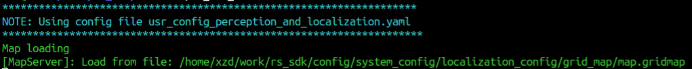
- - -
The following interface means the map is loaded successfully
- - -
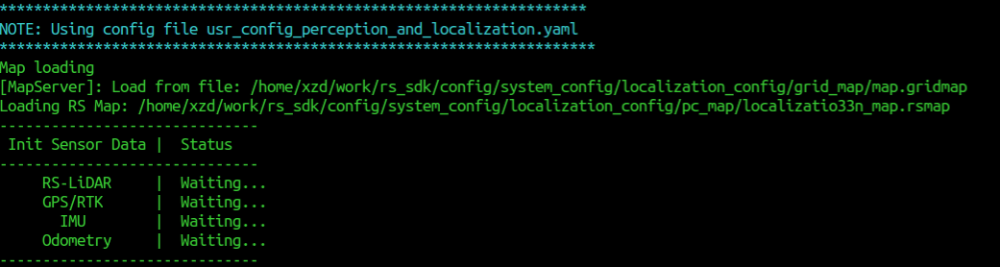
- - -
You can watch the map in rviz now, just excute the following command in the main directory of workspace(send_map_ros need to be set to true).
```
rviz -d rviz/localization.rviz
```

gridmap:

- - -

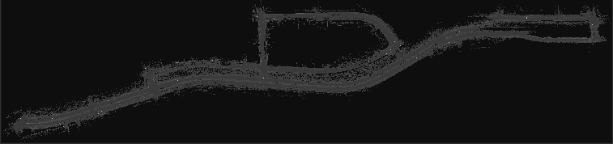


- - -
rsmap:

- - -

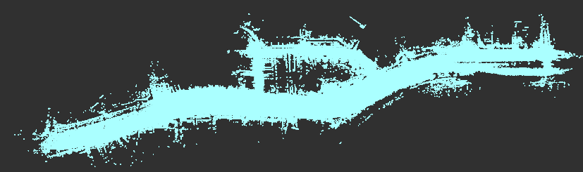


- - -
When the status of the sensors of the LiDAR, GPS/RTK, IMU and Odom is ready, the positioning procedure enters the pose initialization phase as shown in the following figure：

- - -

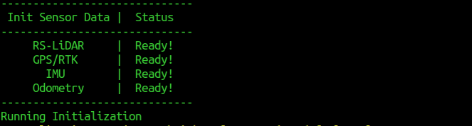

- - -
**NOTE! If run the localization program off-line with rosbag, when entering the pose initialization phase, you MUST PAUSE THE BAG until the initialization is complete! After initialization, you can keep playing the rosbag.**

- - -
In the case of real-time acquisition of sensor date for positioning, the vehicle using a single-point GPS keeps the body stationary as far as possible during the initialization process. Vehicles that use RTK and publish kinematic information allow for movement during initialization.

- - -
After the initialization, if you start the play bag, the locaization algorithm will go the the normal positioning phase and the terminal will display as follow: 

- - -

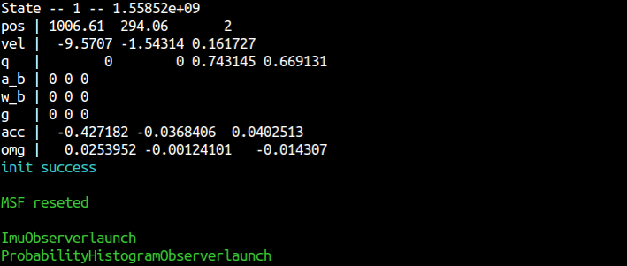

- - -
#### 5.2.5 Result
If the related parameters are set to true, user can use rviz to watch and check the localization result. Excute the following command in the main directory: 
```
rviz -d rviz/localization.rviz 
```

- - -


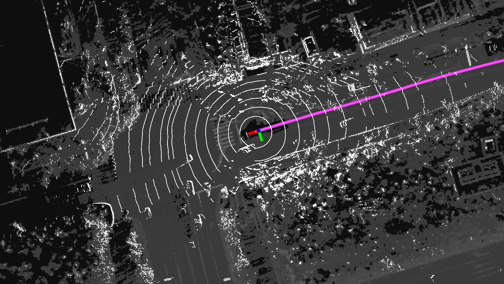


- - -


### 5.3 Quick start the perception algorithm & localization algorithm
####  5.3.1  Set the name of user config file
Enter the condig folder under the main directory
```
cd rs_sdk/config
```
Open usr_config_name.yaml
```
gedit usr_config_name.yaml
```
Set the value of usr_config_name to **usr_config_perception_and_localization.yaml**

- - -

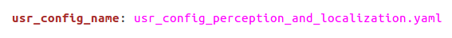

- - -

####  5.3.2  Add the map file
Since the localization algorithm must run with the corresponding map, user need to add the map file manually.
Robosense localization algorithm support two types of map. User can choose to only use gridmap, or use two map at the same time.(CAN NOT only use rsmap!)

- gridmap， file end with .gridmap
- rsmap， file end with .rsmap

**User can buy our application to build map by yourself, or connect us to build the map for you.**
- - -
Copy the gridmap file and rsmap file to      **config/system_config/localization_config**


- - -

- - -
**Please DO NOT modify any files in system_config**
- - -


####  5.3.3  Set the parameters
Enter the usr_config folder inside the config folder
```
cd usr_config/
```
Open the file *usr_config_perception_and_localization.yaml*
```
gedit usr_config_perception_and_localization.yaml
```

- - -
**NOTE! YAML has strict requirements for indentation! Please DO NOT change the indentation of parameters when configuring the parameters.**
- - -

**The following is the default configuration for starting the localization algorithm(one LiDAR)**
- - -
``` yaml
general:                   
    run_localization: true	##If run perception algorithm, set to true
	run_perception: true	##If run perception algorithm, set to true
  
localization:
    common:
        send_localization_freq: 30   ##The frequency of localization algorithm, need to be lower than the highest frequency of sensors.
        grid_map: map.gridmap	##Name of the gridmap file
        rsmap: map.rsmap	##Name of the rsmap file
        map_frame_id: map	##The frame id of the map message

perception:
    common:
    	perception_mode: 1 	## 0: perception with points only, 1: perception with points and pose (from localizaiton or odometry module)
    	with_debug_info: false	##If want to print out the debug info on the terminal while perception running, set to true (recommond to set to false, otherwise the error information from other modules may be ignored)

preprocessing:
  odom:
    speed_unit: 1           ## input speed unit 0:m/s 1:km/h 2:mph, output is m/s
    
sensor:
    lidar:
        common:
            msg_source: 2    ##LiDAR message source, 1: LiDAR Driver 2: ROS bag packets 3: ROS bag points
            send_packets_ros: false	##If publish the original packets on ROS, set to true
            send_points_ros: false	##If publish the original points on ROS, set to true
        lidar:
            - driver:
                  include: ../system_config/sensor_config/lidar/middle_lidar/lidar.yaml 	##Base on the specific LiDAR type, choose the correspond LiDAR yaml config file
              ros:
                  ros_recv_points_topic: /rslidar_points	##If the LiDAR message source is 3, set the correct points subscribe topic name
                  ros_recv_packets_topic: /rslidar_packets	##If the LiDAR message source is 2, set the correct packets subscribe topic name
                  ros_send_points_topic: /rslidar_points	##The topic to publish the original points
                  ros_send_packets_topic: /rslidar_packets	##The topic to publish the original packets
    imu:
        common:
            msg_source: 2			##IMU message source， 1:driver， 2:ROS， 3：Proto
            send_msg_ros: false		##If publish the original IMU message to ROS, set to true
            send_msg_proto: false	##If publish the original IMU message through Proto, set to true
        ros:
            ros_recv_topic: /imu	##If the IMU message source is 2, set the correct IMU message subscribe topic
            ros_send_topic: /imu 	##The topic to publish the original IMU mesage
        proto:
            proto_send_port: 60011	##The destination port number to send IMU message
            proto_send_ip: 192.168.1.255	##The destination IP address to send IMU message
            proto_recv_port: 60011	##If the Imu message source is 3, set the correct IMU message receiver port number
    gnss:
    	common:
            msg_source: 2		##GNSS message source， 1:driver， 2:ROS， 3：Proto
            send_msg_ros: false     ##If publish the original GNSS message to ROS, set to true
            send_msg_proto: false	##If publish the original GNSS message through Proto, set to true
    	ros:
            ros_recv_topic: /gnss	##If the GNSS message source is 2, set the correct GNSS message subscribe topic 
            ros_send_topic: /gnss	##The topic to publish the original GNSS mesage
    	proto:
            proto_send_port: 60012	##The destination port number to send GNSS message
            proto_send_ip: 192.168.1.255	##The destination IP address to send GNSS message
            proto_recv_port: 60012	##If the GNSS message source is 3, set the correct GNSS message receiver port number
	odom:
    	common:
            msg_source: 2		##ODOM message source， 1:driver， 2:ROS， 3：Proto
            send_msg_ros: false     ##If publish the original ODOM message to ROS, set to true
            send_msg_proto: false	##If publish the original ODOM message through Proto, set to true
    	ros:
            ros_recv_topic: /speed	##If the ODOM message source is 2, set the correct ODOM message subscribe topic  
            ros_send_topic: /speed	##The topic to publish the original ODOM mesage
    	proto:
            proto_send_port: 60013		##The destination port number to send ODOM message
            proto_send_ip: 192.168.1.255	##The destination IP address to send ODOM message
            proto_recv_port: 60013	##If the ODOM message source is 3, set the correct ODOM message receiver port number


result_sender:
	ros:
		localization:                                            
            send_pos_ros: true	##If want to publish the localization result to ROS, set to true             
            send_map_ros: true	##If want to publish the map to ROS, set to true    
            send_path_ros: true	##If want to publish the path to ROS, set to true    
		perception:                                              
      		send_obstacle_ros: true		##If want to publish the perception result to ROS, set to true        
    	pointcloud:                                               
      		send_uncompensated_cloud_ros: false	##If want to publish the fusion points without the motion correct on ROS, set to true
      		send_compensated_cloud_ros: false	##If want to publish the fusion points with the motion correct on ROS, set to true
    proto:
		localization:
            send_pos_proto: false	##If want the send the localization result through Protobuf, set to true        
            send_pos_proto_port: 60001		##The destination port number
            send_pos_proto_ip: 192.168.1.255	##The destination IP address      
       perception:
      		send_obstacle_proto: false		##If want the send the perception result through Protobuf, set to true         
      		send_obstacle_proto_port: 60000		##The destination port number 
      		send_obstacle_proto_ip: 192.168.1.255		##The destination IP address
                             
```
- - -
**If use three LiDAR, please replace the sensor-lidar part above with the following : **
```yaml
sensor:
    lidar:
        common:
            msg_source: 2    
            send_packets_ros: false	
            send_points_ros: false	
        lidar:
            - driver:
                  include: ../system_config/sensor_config/lidar/middle_lidar/lidar.yaml 
              ros:
                  ros_recv_points_topic: /middle/rslidar_points		
                  ros_recv_packets_topic: /middle/rslidar_packets	
                  ros_send_points_topic: /middle/rslidar_points		
                  ros_send_packets_topic: /middle/rslidar_packets	
			- driver:
                  include: ../system_config/sensor_config/lidar/left_lidar/lidar.yaml 
              ros:
                  ros_recv_points_topic: /left/rslidar_points		
                  ros_recv_packets_topic: /left/rslidar_packets		
                  ros_send_points_topic: /left/rslidar_points		
                  ros_send_packets_topic: /left/rslidar_packets		
			- driver:
                  include: ../system_config/sensor_config/lidar/right_lidar/lidar.yaml 
              ros:
                  ros_recv_points_topic: /right/rslidar_points		
                  ros_recv_packets_topic: /right/rslidar_packets	 
                  ros_send_points_topic: /right/rslidar_points		
                  ros_send_packets_topic: /right/rslidar_packets	
                  
```

#### 5.3.4  Run
- - -
**NOTE！ If use ROS related functions, please open a new terminal and start roscore first!**
- - -

There are two ways to run rs_sdk, user can choose any one of them.
- Local run

 Enter the "build" folder
```
cd build/
```
run program
```
./rs_sdk_demo
```

- Global run

Open the bashrc file (if use zsh, open zshrc file)
```
gedit ~/.bashrc
```
Add the absolute path of "build" folder at the end of the file, as shown below(the figure is just an example, please fill with the actual path)：

- - -


- - -

source the file
```
source ~/.bashrc
```
After that, user can run rs_sdk_demo anywhere in the computer, no need to enter the "build" file.


* * *

After the program is started, if the following interface appears, which means the program is loading the map. The loading time may different depends on the size of map so please wait patiently.
- - -

- - -
The following interface means the map is loaded successfully
- - -

- - -
You can watch the map in rviz now, just excute the following command in the main directory of workspace(send_map_ros need to be set to true).
```
rviz -d rviz/localization.rviz
```

gridmap:

- - -


- - -
rsmap:

- - -


- - -
When the status of the sensors of the LiDAR, GPS/RTK, IMU and Odom is ready, the positioning procedure enters the pose initialization phase as shown in the following figure：

- - -

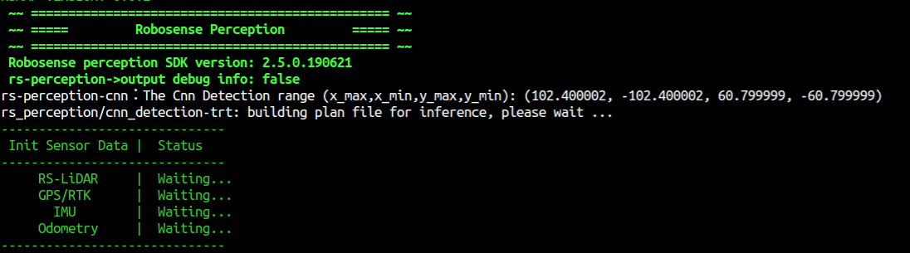

- - -
**NOTE! If run the localization program off-line with rosbag, when entering the pose initialization phase, you MUST PAUSE THE BAG until the initialization is complete! After initialization, you can keep playing the rosbag.**
- - -

In the case of real-time acquisition of sensor date for positioning, the vehicle using a single-point GPS keeps the body stationary as far as possible during the initialization process. Vehicles that use RTK and publish kinematic information allow for movement during initialization.

- - -
After the initialization, if you start the play bag, the locaization algorithm will go the the normal positioning phase and the terminal will display as follow: 

- - -


- - -
#### 5.3.5 Result
If the related parameters are set to true, user can use rviz to watch and check the localization result. Excute the following command in the main directory: 
```
rviz -d rviz/perception_and_localization.rviz 
```
- - -
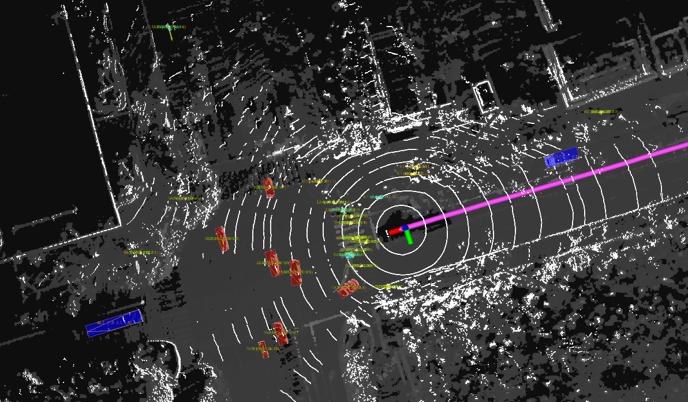

- - -


## 6. Advanced
The following figure shows the message flow in rs_sdk: 

- - -


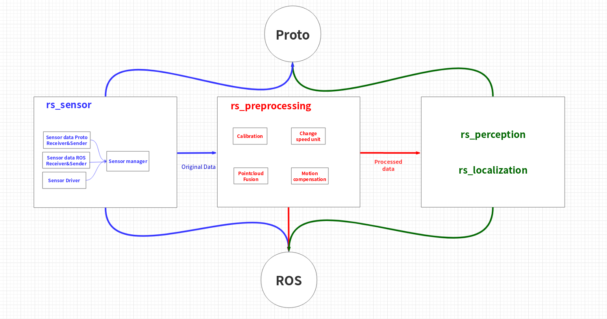


- - -

For users with strong technical level, the specific introduction document and API interface manual of each module can be used for secondary development.

- - -

**Perception module**
- - -
Please refer to ：  [README_CN](rs_perception/README_EN.md)

- - -

**Localization module**

- - -
Please refer to ：  [README_EN](rs_localization/README_CN.md)

- - -

API interface：  [API](rs_localization/API.md)


- - -
**Sensor module**

- - -
API interface： [API](rs_sensor/API.md)

## 7. Common Error

- - -

(1) KEY_NOT_FOUND

- - -


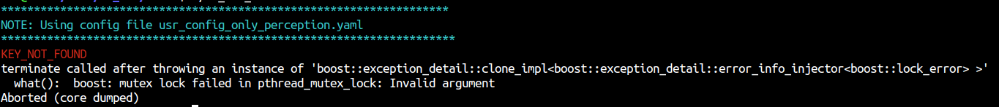

- - -
Reason: 1, USB key is not plug in   2, the **install_denpendency.sh** is not run
- - -
Soulution: Stop the program and plug in the key, wait for 5~10 seconds and restart. Or run install_denpendency.sh and restart.
- - -
(2) KEY_FEATURE_NOT_FOUND

- - -

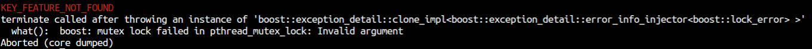

- - -
Reason: The license for robosense localization algorithm and perception algorithm are independent. If user only has license for one of them and try to start the other one, the error occur.

- - -
Solution: Modify usr_config and only start the algorithm with license.
- - -
(3) Wrong perception mode

- - -

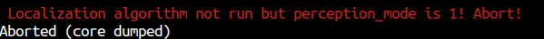

- - -

Reason: When the **preception_mode** is set to **1**, which means the perception algorithm need to receiver the result of localization algorithm to process. At this time, if **run_localization** is set to **false**, which means the localization algorithm is not run, the error occur.
- - -
Solution: Set the **perception_mode** to **0**, or set the **run_localization** to **true**.
- - -

(4)Preprocessing Timeout

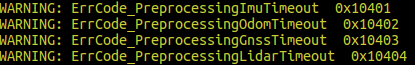

- - -
Reason: Preprocessing module does not receive the data
- - -
Solution: Find out the specific reason
- - -
(5) Wrong perception mode

- - -
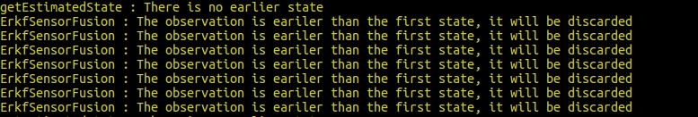
- - -

Reason: When play rosbag to run localization algorithm offline, this error may occur. The reason is that ros possiblely store some earlier data. 
- - -
Solution: Restart the **roscore** and run rs_sdk again.
- - -


